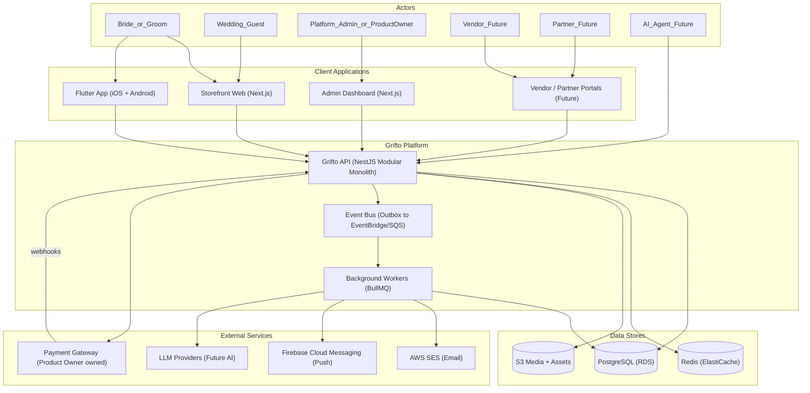
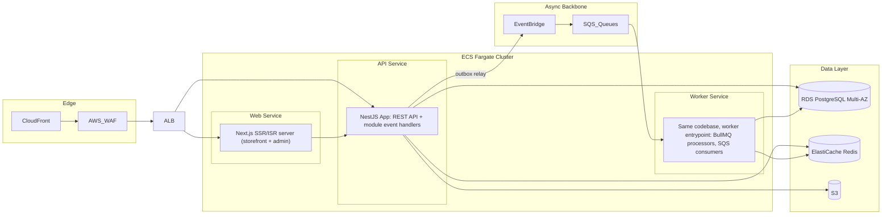
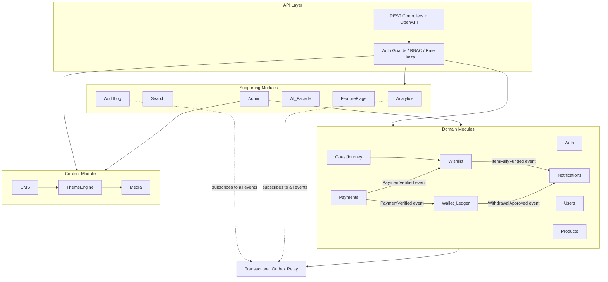
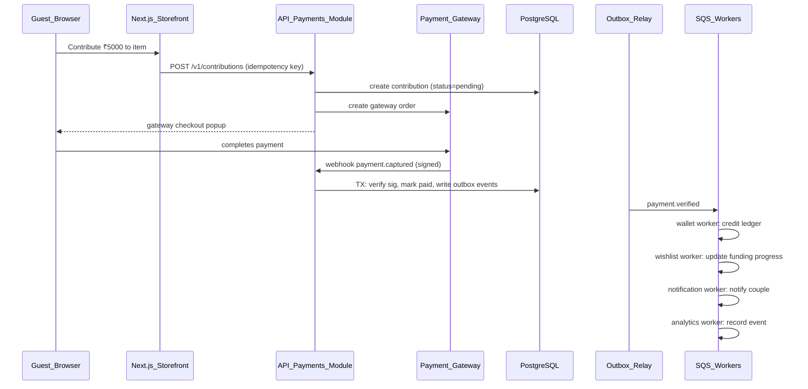

# 2. High-Level System Architecture · 3. Technology Stack · 4. Why Each Technology Was Chosen

## 2.1 System context (C4 level 1)

Key property: **every arrow into the platform goes through the same API**. There is no admin-only backend, no mobile backend-for-frontend, no direct database access from any client. This is the structural guarantee behind "no duplicated business logic".

## 2.2 Container view (C4 level 2)

Three ECS services, **one backend codebase**: the API service and Worker service are the same NestJS build started with different entrypoints. This keeps business logic in one place while letting API latency and job throughput scale independently.

## 2.3 Module view of the monolith (C4 level 3)

### Module rules (the discipline that makes later extraction possible)

1. **Each module owns its tables.** No other module issues SQL against them. Cross-module reads go through the owning module's exported service interface.
2. **Commands are synchronous, side effects are events.** `Payments.verify()` returns a result; wallet crediting, wishlist progress, and notifications all react to the `payment.verified` domain event.
3. **Events are written to an outbox table in the same DB transaction as the state change**, then relayed to EventBridge. This guarantees no lost events and no phantom events — the classic dual-write problem is designed out from day one.
4. **Module extraction path:** when a module must become a service, its tables move to a new database, its exported interface becomes an HTTP/gRPC client, and its event subscriptions re-point from in-process to SQS. Consumers don't change.

## 2.4 Complete technology stack (deliverable §3)

| Layer | Technology | Role |
|---|---|---|
| Web framework | **Next.js 15+ (App Router)** | Storefront + customer dashboard + admin dashboard |
| UI | **Tailwind CSS 4, shadcn/ui, Radix UI** | Design system foundation |
| Web state/data | **TanStack Query, Zustand, React Hook Form, Zod** | Server cache, editor state, forms, validation |
| Editor interactions | **dnd-kit, Motion** | Theme-editor drag & drop, animation |
| Mobile | **Flutter (Dart), Riverpod, generated Dart SDK** | iOS + Android from one codebase |
| Backend | **Node.js 22 LTS, NestJS 11, TypeScript** | Modular monolith |
| ORM / DB access | **Drizzle ORM + raw SQL for ledger paths** | Type-safe schema, migrations |
| API contract | **OpenAPI 3.1 + openapi-generator (TS + Dart clients)** | One contract, generated SDKs |
| Database | **PostgreSQL 16 (RDS), pgvector extension** | Source of truth + embeddings |
| Cache / queue | **Redis 7 (ElastiCache), BullMQ** | Cache, sessions, rate limits, jobs |
| Events | **Transactional outbox → EventBridge → SQS** | Domain events, module decoupling |
| Search | **Postgres FTS (MVP) → OpenSearch (Phase 2)** | Catalog and admin search |
| Media | **S3, CloudFront, Sharp on Lambda** | Uploads, WebP/AVIF, transformations |
| Email / push | **SES + MJML templates; FCM** | Notifications |
| Payments | **Product-owner gateway (Razorpay-compatible adapter pattern)** | Contributions + payouts |
| Compute | **ECS Fargate** | API, workers, Next.js SSR |
| Edge | **CloudFront, AWS WAF, Route 53, ACM** | CDN, security, DNS, TLS |
| Secrets / crypto | **Secrets Manager, KMS** | Credentials, encryption keys |
| Observability | **CloudWatch, OpenTelemetry, Sentry** | Logs, traces, errors |
| IaC / CI | **Terraform, GitHub Actions, Docker** | Infrastructure and pipeline |
| Monorepo | **Turborepo + pnpm** | Task orchestration, caching |

## 2.5 Why each technology was chosen (deliverable §4)

### NestJS over Express/Fastify-bare, Django, Rails, Go, Spring

- **For:** first-class module system (maps 1:1 to bounded contexts), dependency injection (testability, swappable adapters for the payment gateway), built-in OpenAPI generation, guards/interceptors for cross-cutting RBAC and audit, huge TypeScript talent pool, one language across web + backend.
- **Against:** more opinionated/heavier than bare Fastify; decorator-based DI has a learning curve.
- **Trade-off accepted:** the structure NestJS imposes is exactly the structure a modular monolith needs. A bare framework would require us to hand-build the module system NestJS ships with. Go/Spring were rejected for team-splitting (two languages) with no MVP-relevant performance need; Rails/Django rejected because the TypeScript-everywhere bet (shared types between API, web, theme schemas) is worth more than their scaffolding speed.

### TypeScript end-to-end

Theme section schemas, API DTOs, and domain events are **shared types** consumed by both the backend and the web frontends from monorepo packages. This eliminates an entire category of contract-drift bugs and is the single biggest developer-experience multiplier for a small team.

### PostgreSQL over MySQL, MongoDB, DynamoDB

- **For:** ACID for money paths; JSONB gives document flexibility for theme layouts *inside* the transactional store (a page publish and its version snapshot commit atomically); mature indexing (GIN on JSONB, partial indexes); pgvector defers a vector DB; RDS operational maturity; row-level locking for wallet holds.
- **Against MongoDB:** the money and identity model is relational; splitting money into SQL and content into Mongo doubles operational load and breaks cross-domain transactions (publish page + write audit log).
- **Against DynamoDB:** access patterns (admin filtering, analytics, ad-hoc joins) are unknown and evolving; Dynamo punishes evolving access patterns.

### Drizzle ORM over Prisma, TypeORM

- **For:** SQL-transparent (critical for ledger queries, `SELECT ... FOR UPDATE`, window functions), lightweight runtime, migrations as plain SQL that a reviewer can read, excellent JSONB typing.
- **Against:** smaller ecosystem than Prisma.
- **Trade-off accepted:** Prisma's engine abstracts SQL exactly where the wallet needs SQL to be explicit. For a financial ledger, "the ORM hid the lock" is not an acceptable incident report. Raw SQL is used directly for ledger hot paths regardless of ORM.

### REST + OpenAPI over GraphQL (summary — full analysis in file 05)

REST with generated clients gives HTTP caching at CloudFront, simple per-endpoint authorization, trivial webhook/partner integration, and a stable public API surface. GraphQL's payoff arrives when many teams own many clients with divergent data needs — Phase 3 territory. The escape hatch: because all logic lives in module services, a GraphQL layer can later be mounted beside REST without touching business logic.

### ECS Fargate over EC2 (PDF's proposal) and EKS

- **Over EC2:** no patching, no capacity management, blue-green deploys and auto-scaling are configuration rather than projects. Cost at MVP scale is comparable to the PDF's t3.medium budget (file 10).
- **Over EKS:** Kubernetes costs ~$75/month for the control plane alone and, more importantly, a skill set the MVP team should not need. Nothing in the roadmap requires K8s primitives; if Phase 3 does, containers port trivially.

### Redis + BullMQ at MVP (upgrading the PDF's "optional")

The scope PDF itself lists emails, notifications, QR generation, image processing, and wallet reconciliation as background work. A payments platform cannot send emails synchronously in request handlers or drop a payout webhook because a process restarted. BullMQ (Redis-backed) provides retries, backoff, and dead-letter handling with zero additional infrastructure since Redis is already present for caching and sessions.

### Transactional outbox + EventBridge over "just call the other module"

Direct in-process calls couple modules and lose events on crashes between DB commit and side effect. The outbox pattern (event row committed atomically with state change; relay publishes to EventBridge; SQS delivers to workers with retries) is ~200 lines of infrastructure code that buys: guaranteed delivery, an audit stream for free, analytics ingestion for free, and the microservice extraction path.

### Turborepo + pnpm over Nx, Lerna, polyrepo

- **For:** minimal configuration, remote build caching, pnpm workspace efficiency; polyrepo would break the shared-types bet.
- **Against Nx:** more powerful generators but heavier mental model; Turborepo's simplicity fits a small team. Migration Nx-ward later is mechanical if code generation needs grow.

### Flutter over React Native (given) and server-driven UI

Flutter is mandated by the vision and is a good mandate: single rendering engine (no per-platform UI bugs), strong performance. The architecture adds one decision: CMS-driven screens in the app render from the **same theme JSON documents** as the web (file 06), so marketing content changes never require an app-store release.

### Sentry + OpenTelemetry + CloudWatch

CloudWatch alone (PDF proposal) is sufficient for infrastructure metrics but poor for error triage and distributed tracing. Sentry's free tier covers MVP error tracking; OTel instrumentation is added now while the codebase is small because retrofitting tracing is miserable.

## 2.6 Request and event flow — the canonical example

The guest-contribution flow exercises every architectural seam and is the reference for how the system composes (detail in file 09):

