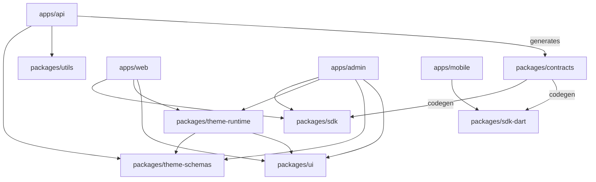

# 5. Monorepo Structure · 6. Folder Structure

## 5.1 Why a monorepo

The platform's core promise — one backend, shared types, zero duplicated business logic across storefront, admin, mobile, and portals — is only enforceable when the API, its consumers, and their shared contracts live in one repository with one CI pipeline. Concretely, a monorepo buys:

- **Atomic contract changes.** An API change, its OpenAPI spec update, the regenerated SDK, and every consumer fix land in one PR. No "version skew window" between repos.
- **Shared packages as the single source of truth** for theme schemas, domain types, validation (Zod schemas shared by API and forms), and design system.
- **One CI, one release train** with Turborepo caching so only affected apps rebuild.

The Flutter app lives in the same repo (under `apps/mobile`) even though it doesn't share the JS toolchain — it consumes the generated Dart SDK from `packages/sdk-dart`, and keeping it in-repo keeps contract regeneration atomic. If Flutter CI friction ever outweighs this, it can split out with the Dart SDK published as a private pub package; nothing else changes.

**Tooling: Turborepo + pnpm workspaces.** pnpm for disk-efficient installs and strict dependency isolation (an app cannot accidentally import an undeclared dependency); Turborepo for task graph orchestration (`build`, `lint`, `test`, `typecheck`) with local + remote caching.

## 5.2 Repository layout

```
grifto/
├── apps/
│   ├── api/                    # NestJS modular monolith (API + worker entrypoints)
│   ├── web/                    # Next.js — storefront + customer dashboard
│   ├── admin/                  # Next.js — Shopify-style admin dashboard
│   └── mobile/                 # Flutter — iOS + Android
│
├── packages/
│   ├── contracts/              # OpenAPI spec (generated from API), domain event schemas
│   ├── sdk/                    # Generated TypeScript API client + TanStack Query hooks
│   ├── sdk-dart/               # Generated Dart API client (consumed by apps/mobile)
│   ├── theme-schemas/          # Section/block schema definitions + Zod validators (shared API ↔ web ↔ admin)
│   ├── theme-runtime/          # React renderer for theme JSON documents (shared web ↔ admin preview)
│   ├── ui/                     # Design system: shadcn-based components, Tailwind preset, tokens
│   ├── config/                 # Shared eslint, tsconfig, tailwind, prettier configs
│   └── utils/                  # Shared pure utilities (money, dates, slugs)
│
├── infra/
│   ├── terraform/              # All AWS infrastructure as code
│   │   ├── modules/            #   reusable modules (vpc, ecs-service, rds, redis, cdn, ...)
│   │   └── envs/               #   dev / staging / prod compositions
│   └── docker/                 # Dockerfiles, docker-compose.yml for local dev
│
├── docs/
│   └── architecture/           # This document set
│
├── .github/
│   └── workflows/              # CI/CD pipelines
│
├── turbo.json
├── pnpm-workspace.yaml
└── package.json
```

### Package dependency graph



The critical edges: `theme-schemas` is imported by the **API** (to validate stored layout documents), the **admin** (to render setting panels in the editor), and `theme-runtime` (to render pages). One definition drives validation, editing UI, and rendering — this is what makes the theme engine schema-driven rather than convention-driven.

## 6.1 Backend folder structure (`apps/api`)

NestJS modules mirror the bounded contexts from file 02. Every module follows the same internal layout (a lightweight hexagonal shape — domain logic isolated from transport and persistence):

```
apps/api/
├── src/
│   ├── main.ts                    # API entrypoint
│   ├── worker.ts                  # Worker entrypoint (BullMQ processors, SQS consumers)
│   │
│   ├── modules/
│   │   ├── auth/
│   │   │   ├── auth.module.ts
│   │   │   ├── api/               # controllers, DTOs, guards (transport layer)
│   │   │   ├── domain/            # services, entities, domain events (pure logic)
│   │   │   ├── infra/             # repositories (Drizzle), external adapters
│   │   │   └── auth.public.ts     # ONLY file other modules may import
│   │   ├── users/
│   │   ├── wishlist/
│   │   ├── guest-journey/         # guest identification, reservations, address requests
│   │   ├── payments/              # gateway adapter, contributions, webhooks
│   │   ├── wallet/                # ledger, holds, withdrawals
│   │   ├── products/              # Grifto catalog + URL metadata scraper
│   │   ├── notifications/         # in-app, email (SES), push (FCM), templates
│   │   ├── cms/                   # content entries, navigation, forms, SEO
│   │   ├── theme/                 # theme engine: registry, pages, versions, publish
│   │   ├── media/                 # uploads, image pipeline, asset manager
│   │   ├── analytics/             # event ingestion + admin metrics queries
│   │   ├── search/                # search interface (PG FTS impl now, OpenSearch later)
│   │   ├── admin/                 # admin-only aggregations (customer 360, timeline)
│   │   ├── ai/                    # AI facade (Phase 2+, interface defined now)
│   │   ├── feature-flags/
│   │   └── audit/                 # audit log (subscribes to all domain events)
│   │
│   ├── shared/
│   │   ├── events/                # outbox writer, relay, event base types
│   │   ├── database/              # Drizzle client, migration runner, TX helpers
│   │   ├── queue/                 # BullMQ setup, queue registry
│   │   ├── config/                # typed env config (validated at boot)
│   │   └── observability/         # logger, OTel, request context
│   │
│   └── openapi/                   # spec generation script → packages/contracts
├── drizzle/                       # SQL migrations (per-module folders)
└── test/                          # e2e tests against dockerized PG + Redis
```

**Enforced boundaries:** an ESLint rule (`import/no-restricted-paths`) forbids importing anything from another module except its `*.public.ts` barrel. This turns the architecture's central discipline (file 02, module rules) into a CI failure instead of a code-review hope.

## 6.2 Web app folder structure (`apps/web`)

```
apps/web/
├── app/
│   ├── (site)/                    # theme-rendered public pages
│   │   ├── [[...slug]]/page.tsx   # catch-all: resolves slug → theme page document → render
│   │   └── layout.tsx             # theme settings → CSS variables, header/footer sections
│   ├── (auth)/                    # login, register, forgot-password
│   ├── (dashboard)/               # authenticated customer area
│   │   ├── wishlist/
│   │   ├── wallet/
│   │   ├── notifications/
│   │   └── profile/
│   ├── w/[shareSlug]/             # public wishlist + invitation (QR/URL target, ISR)
│   └── api/                       # route handlers ONLY for web-specific glue (preview tokens, revalidate)
├── components/                    # app-specific components (non-design-system)
├── lib/                           # API client setup, auth session helpers
└── next.config.ts
```

The catch-all `(site)` route is the structural expression of "every page is powered by the theme editor": marketing pages are not React pages, they are theme documents resolved at request time (with ISR caching — file 04).

## 6.3 Admin app folder structure (`apps/admin`)

```
apps/admin/
├── app/
│   ├── (dashboard)/
│   │   ├── page.tsx               # analytics home
│   │   ├── customers/             # list, customer 360 view, timeline
│   │   ├── products/
│   │   ├── orders-contributions/
│   │   ├── payouts/               # withdrawal review & approval
│   │   ├── revenue/
│   │   ├── analytics/
│   │   ├── notifications/
│   │   ├── cms/                   # content entries, navigation, forms, templates
│   │   ├── media/                 # media library
│   │   ├── settings/              # fees, roles & permissions, API keys, feature flags, system config
│   │   └── logs/                  # app logs view + audit logs
│   └── theme-editor/              # full-screen editor shell (own layout, no dashboard chrome)
│       ├── [themeId]/
│       └── preview-frame/         # iframe host wiring postMessage to storefront preview
├── components/
└── lib/
```

## 6.4 Flutter folder structure (`apps/mobile`)

Feature-first layout mirroring the backend modules (detail in file 06):

```
apps/mobile/
├── lib/
│   ├── main.dart
│   ├── core/                      # router, DI, theme, SDK client setup, FCM
│   ├── features/
│   │   ├── auth/
│   │   ├── wishlist/
│   │   ├── wallet/
│   │   ├── notifications/
│   │   ├── profile/
│   │   └── cms_pages/             # server-driven UI renderer for theme documents
│   └── shared/                    # widgets, formatting, error handling
└── pubspec.yaml
```

## 6.5 Local development

`infra/docker/docker-compose.yml` runs PostgreSQL, Redis, LocalStack (S3/SQS/EventBridge/SES), and Mailpit (email preview). `pnpm dev` starts api + web + admin via Turborepo; the Flutter app runs against the same local API. One command, full stack, no AWS account needed for feature work.
