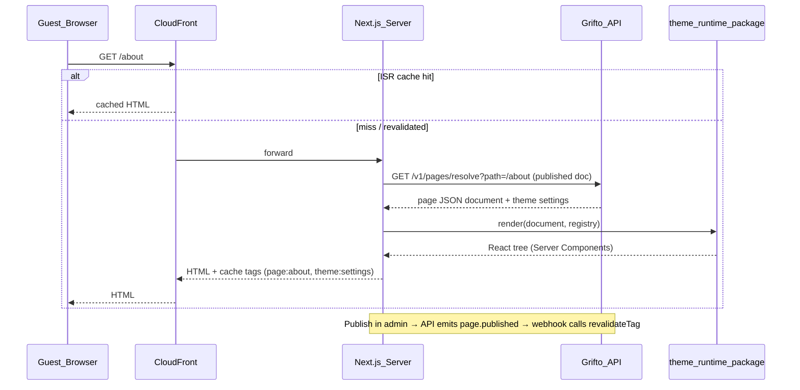

# 7. Frontend Architecture

Two Next.js applications share one design system and one generated SDK:

- **`apps/web`** — storefront, public wishlist/invitation pages, customer dashboard. Public-facing, SEO-critical, must be fast on cheap Android phones over 4G (the realistic guest device profile when scanning a QR code at an Indian wedding).
- **`apps/admin`** — Shopify-style admin. Auth-walled, SEO-irrelevant, interaction-heavy (data tables, theme editor). Optimized for capability, not first paint.

Splitting them keeps the storefront bundle free of editor weight (dnd-kit, schema panels, charting) and lets each deploy independently.

## 7.1 Next.js App Router vs React SPA — the framing decision

| Criterion | Next.js App Router | React SPA (Vite) |
|---|---|---|
| SEO for marketing + wishlist pages | Native SSR/ISR | Requires prerender service or SSR bolt-on |
| First contentful paint on QR-code cold visit | HTML streamed from server/CDN | Blank shell until JS parses |
| Theme-page rendering | Server Components render JSON docs with zero client JS for static sections | Everything client-rendered |
| ISR / cache revalidation | Built-in (`revalidateTag`) | Hand-rolled |
| Complexity cost | Server/client mental model, App Router conventions | Simpler mental model |
| Hosting | Node server (ECS) or edge | Static bucket |

**Decision:** App Router for both apps.

- For **web**, it is not close: the guest journey starts with a cold hit on a shared URL; SSR + ISR means that page is cached HTML at CloudFront, and funding progress hydrates client-side. Invitation pages get proper Open Graph tags for WhatsApp link previews — a make-or-break sharing feature in this market.
- For **admin**, a SPA would be defensible (it's behind auth), but using the same framework as web means one deployment pattern, one routing model, shared `theme-runtime` for the editor preview, and no context-switching for a small team. The admin uses App Router mostly as "a well-organized SPA with server-side auth gating" — that's fine.

### Server Components vs Client Components policy

- **Server Components (default):** theme-document rendering, CMS content, initial data for dashboard pages, anything without interactivity. Benefit: no bundle cost, data fetched server-side next to the API.
- **Client Components (opt-in):** contribution/payment flows, forms, the entire theme editor, notification center, anything with local state or browser APIs.
- **Rendering modes per route:**
  - Marketing/theme pages: **ISR** — cached, revalidated on publish via `revalidateTag('page:{slug}')` triggered by the theme module's publish event.
  - Public wishlist `w/[shareSlug]`: **ISR with short revalidation + client hydration** of live funding progress. The PDF requires updates to reflect without regenerating the link — ISR + TanStack Query polling satisfies this.
  - Customer dashboard: **SSR** (personalized, no caching) with streaming (`Suspense`) so the shell paints before wallet history loads.
  - Admin: SSR shell, then client-side data fetching via TanStack Query (interaction-heavy pages want client cache semantics, optimistic updates, refetch-on-focus).

## 7.2 Data & state — TanStack Query vs Redux Toolkit vs Zustand

These solve **three different problems**; the mistake to avoid is using one for all three.

| Problem | Winner | Why |
|---|---|---|
| Server state (API data, caching, retries, invalidation) | **TanStack Query** | Purpose-built: request dedup, stale-while-revalidate, optimistic updates, pagination. Generated SDK ships typed query/mutation hooks, so `useWishlist()` is codegen output, not hand-written fetch logic. |
| Complex client-only state (theme editor document, selection, undo/redo) | **Zustand** | Minimal API, no provider ceremony, transient updates without re-render storms (critical while dragging), middleware-friendly (the editor's undo/redo is a Zustand middleware over document patches — file 07). |
| Global app state (Redux's classic role) | **Mostly eliminated** | Server state → TanStack Query; auth session → cookie + server components; the residue (UI prefs, modals) → tiny Zustand stores. |

**Why not Redux Toolkit anywhere?** RTK is excellent, but its remaining advantage (strict event-sourced state discipline, devtools time-travel) matters for large teams with sprawling shared state. Grifto's only genuinely complex client state is the theme editor document, which needs *custom* history semantics (undo by JSON patch inversion, not by state snapshot replay) that fit Zustand middleware more naturally than Redux reducers. Adding RTK would mean three state tools instead of two.

## 7.3 Forms & validation — React Hook Form + Zod

- **React Hook Form:** uncontrolled inputs (performance on large forms — the withdrawal form, admin settings), first-class error/dirty state, tiny bundle.
- **Zod:** schemas defined once in shared packages and reused in three places — RHF client validation, NestJS DTO validation (`nestjs-zod`), and theme setting schemas. A guest-identification form and its API endpoint literally share one schema object. This kills the "frontend allowed what backend rejected" bug class.
- Rejected alternative — Formik: heavier re-render model, maintenance has slowed; Yup loses to Zod on TypeScript inference.

## 7.4 UI system — Tailwind + shadcn/ui + Radix + React Aria

- **Tailwind CSS:** utility styling with a shared preset in `packages/ui`; design tokens (colors, spacing, typography) are CSS variables — which is precisely how the theme engine's global settings inject brand values at runtime (file 07). A CSS-in-JS system would fight Server Components; Tailwind is inert at runtime.
- **shadcn/ui:** copy-in components (not a dependency) built on Radix — full ownership for the deep customization the admin needs (Shopify-grade data tables, command palette) without fork pain.
- **Radix UI:** headless accessible primitives (dialogs, popovers, menus) under shadcn. Accessibility (focus traps, ARIA, keyboard navigation) is a PDF requirement and not something to hand-build.
- **React Aria — where it fits:** Radix covers most primitives; React Aria's hooks are used selectively where Radix has no primitive (e.g., `useMove`/slider math for the editor's spacing controls, date pickers via React Aria Components). Rule: Radix first, React Aria for gaps, never both for the same primitive.

## 7.5 Interaction libraries

- **dnd-kit:** drag & drop for the theme editor (section reordering, block nesting, palette-to-canvas insertion) and wishlist reordering. Chosen over `react-beautiful-dnd` (unmaintained, no nesting) and HTML5 DnD (poor touch support, no keyboard a11y). dnd-kit gives sensors (pointer/keyboard/touch), collision strategies for nested containers, and accessible announcements.
- **Motion (framer-motion successor):** micro-interactions — funding progress animation, the "fully funded" celebration moment, editor panel transitions, banner auto-slider. Layout animations (`layout` prop) make section reordering in the editor preview feel physical. Used sparingly on the storefront to protect bundle size (`LazyMotion` + `domAnimation` subset).

## 7.6 Storefront rendering pipeline (theme documents → HTML)

`theme-runtime` maps each section/block `type` in the document to a registered React component and passes validated settings as props. Sections marked interactive (contribution widget, forms) render as client components inside the server-rendered shell.

## 7.7 Performance budget & tactics

- **Budgets (storefront):** LCP < 2.5s on mid-tier Android/4G; JS < 150KB gzip on marketing pages; public wishlist page interactive < 3.5s.
- Route-level code splitting is automatic; the payment widget, QR download, and Motion load dynamically on interaction.
- `next/image` with the media pipeline's pre-generated WebP/AVIF renditions (file 11); explicit dimensions to eliminate CLS from banner sliders.
- Fonts self-hosted via `next/font` (no third-party font requests).
- TanStack Query defaults: `staleTime` 30s for wishlist funding data (fresh enough for guests), infinite-stale for catalog/static data invalidated by tags.
- Admin exempt from storefront budgets but uses virtualized tables (TanStack Virtual) for customer/transaction lists.

## 7.8 Frontend testing strategy

- **Unit:** Vitest + Testing Library for components and Zustand stores (the undo/redo middleware has exhaustive unit tests).
- **Contract:** the generated SDK is typechecked against each app in CI — an API-breaking change fails the build before review.
- **E2E:** Playwright on the two revenue-critical journeys — guest contribution end-to-end (with gateway sandbox) and wishlist creation/share — plus theme editor publish→storefront smoke test.
