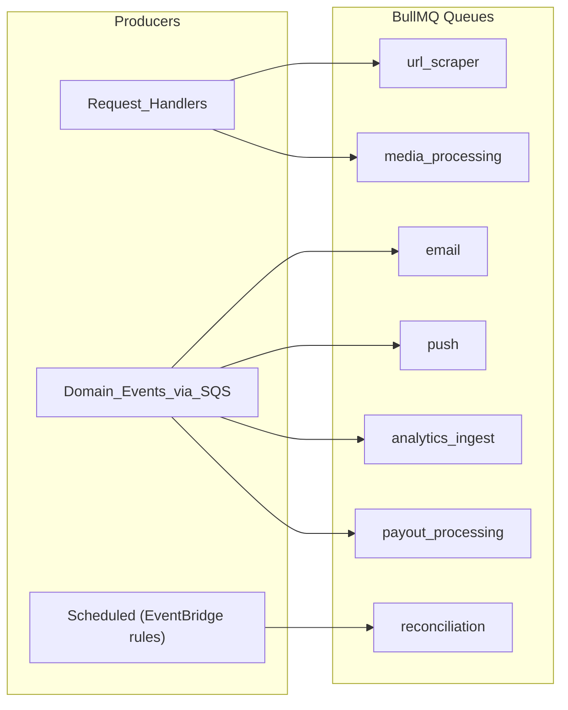
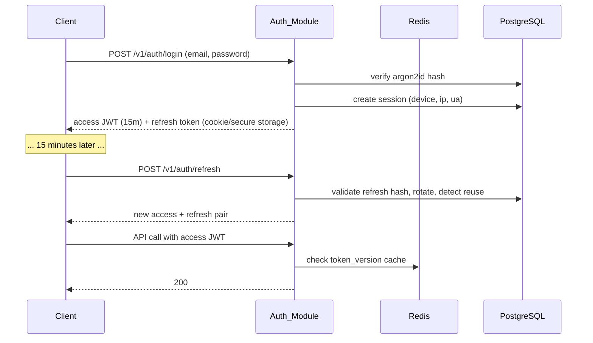
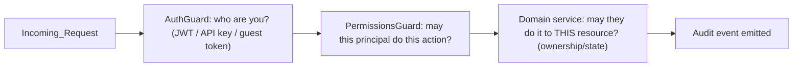

# 8. Backend Architecture · 15. API Design · 16. Authentication Flow · 17. Authorization Strategy

## 8.1 Backend architecture

The backend is a **NestJS modular monolith** deployed as two ECS services from one codebase: `api` (HTTP) and `worker` (BullMQ processors + SQS consumers). Structure, module rules, and the outbox pattern are defined in file 02; folder layout in file 03. This file covers the runtime behavior.

### Module anatomy (hexagonal-lite)

Every module has three layers:

- **`api/`** — controllers, DTOs (Zod schemas from shared packages), guards. Knows HTTP, knows nothing about persistence.
- **`domain/`** — services holding all business rules, domain entities, domain event definitions. Pure TypeScript; unit-testable without DB or HTTP.
- **`infra/`** — Drizzle repositories, external adapters (payment gateway client, scraper, FCM). Implements interfaces declared in `domain/`.

External dependencies are always behind an interface. The payment gateway is the canonical case: `domain/` depends on `PaymentGatewayPort`; `infra/` provides the product-owner-gateway adapter. Sandbox and future gateways are new adapters, zero domain change.

### Synchronous vs asynchronous work

**Rule: a request handler may do exactly one transactional state change plus enqueue work.** Everything else is async.

| Synchronous (request path) | Asynchronous (workers) |
|---|---|
| Auth, CRUD, wishlist reads/writes | Emails (SES), push (FCM) |
| Contribution creation + gateway order | QR code generation, image processing |
| Webhook signature verification + state transition + outbox write | Wallet crediting, wishlist progress recompute |
| Withdrawal request + ledger hold (one TX) | Payout gateway calls, reconciliation, analytics ingestion |
| Page publish (doc swap + version snapshot) | Cache revalidation webhooks, URL metadata scraping |

Two async channels, used deliberately:

- **BullMQ (Redis)** for *jobs*: things one module asks to be done (send this email, scrape this URL, generate this QR). Retries with exponential backoff, dead-letter queue, per-queue concurrency.
- **Outbox → EventBridge → SQS** for *domain events*: facts other modules react to (`payment.verified`, `wishlist.item.fully_funded`, `withdrawal.approved`). Fan-out to multiple consumers, durable, replayable, and the future extraction seam.

### Background job taxonomy

## 15.1 REST vs GraphQL — the decision, argued

**Decision: REST-first with OpenAPI 3.1 as the machine-readable contract, generated TypeScript and Dart SDKs. GraphQL deferred, with a defined trigger for adoption.**

| Dimension | REST + OpenAPI | GraphQL |
|---|---|---|
| Many client types (web, Flutter, portals, public API) | Generated typed SDKs per language; identical semantics everywhere | Client-shaped queries genuinely help divergent clients |
| HTTP/CDN caching | Native — public wishlist and CMS endpoints cache at CloudFront by URL | POST-based; needs persisted queries + custom cache keys |
| Authorization | Per-endpoint guards; easy to reason about, easy to audit | Per-field authorization; subtle leak surface (introspection, nested resolvers) |
| Public/partner API | The industry default; webhooks, API keys, rate limits per route are standard patterns | Harder to version, rate-limit, and document for third parties |
| Payments/webhooks | Natural fit | Awkward |
| N+1 / over-fetching | Mitigated by purpose-built composite endpoints (e.g., customer-360) | Solved natively, at resolver/dataloader complexity cost |
| Team cost | Low; OpenAPI tooling mature | Schema design, dataloaders, query-depth limits, gateway ops |

The strongest GraphQL argument here is the Flutter app wanting differently-shaped data than web. In practice Grifto's clients consume the *same* domain shapes (wishlist, wallet, notifications); divergence is cosmetic. The strongest REST argument is decisive: the guest journey and CMS pages are the highest-traffic surfaces and they are **anonymously cacheable by URL** — GraphQL forfeits that for nothing in return at this stage.

**Adoption trigger for GraphQL (Phase 3):** when vendor/partner portals plus public API consumers demonstrably need query flexibility the REST composites can't serve without endpoint sprawl, mount an Apollo/Yoga layer *beside* REST, resolving against the same module services. The modular monolith makes this additive, not a migration.

## 15.2 API design conventions

- **Base path & versioning:** `/v1/...` URI versioning. Additive changes don't bump versions; breaking changes create `/v2` routes per resource (not a big-bang v2). Generated SDKs pin versions.
- **Resource style:** plural nouns, nesting max one level (`/v1/wishlists/{id}/items`), actions that aren't CRUD are explicit sub-resources (`POST /v1/withdrawals/{id}/approve`).
- **Envelopes:** success returns the resource bare; errors return RFC 9457 problem+json (`type`, `title`, `status`, `detail`, `code`, `traceId`). Error `code` is a stable machine string (`WALLET_INSUFFICIENT_BALANCE`) that SDKs surface as typed errors.
- **Pagination:** cursor-based (`?cursor=&limit=`) everywhere lists can grow (transactions, notifications, audit logs); offset pagination only for small bounded admin lists.
- **Idempotency:** all money-moving POSTs (`/contributions`, `/withdrawals`) require an `Idempotency-Key` header, stored with a request-hash and replayed response (file 09).
- **Rate limiting:** Redis token buckets — per-IP for anonymous routes, per-user for authenticated, per-API-key for public API. Guest identification and payment endpoints get stricter buckets.
- **Webhooks (inbound):** gateway webhooks verified by HMAC signature + timestamp tolerance; processed idempotently by gateway event id.
- **Public API (future):** the same `/v1` surface, gated by API-key scopes — not a separate codebase. API keys are hashed at rest, scoped, and revocable from the admin.

### Representative endpoint map

| Area | Endpoints (abridged) |
|---|---|
| Auth | `POST /v1/auth/register`, `/login`, `/refresh`, `/logout`, `/forgot-password` |
| Wishlist | `GET/POST /v1/wishlists`, `POST /v1/wishlists/{id}/items` (manual / `source=url` / `source=catalog`), `GET /v1/wishlists/{id}/share` (URL + QR) |
| Guest | `POST /v1/guest/identify`, `GET /v1/public/wishlists/{shareSlug}`, `POST /v1/contributions`, `POST /v1/reservations`, `POST /v1/gift-messages`, `POST /v1/address-requests`, `POST /v1/address-requests/{id}/approve|reject` |
| Payments | `POST /v1/payments/webhook`, `GET /v1/contributions/{id}` |
| Wallet | `GET /v1/wallet`, `GET /v1/wallet/transactions`, `POST /v1/withdrawals`, `POST /v1/withdrawals/{id}/approve|reject` (admin) |
| Content | `GET /v1/pages/resolve?path=`, `GET /v1/cms/entries/{key}`, theme editor APIs (file 07) |
| Admin | `/v1/admin/customers`, `/v1/admin/customers/{id}/timeline`, `/v1/admin/analytics/*`, `/v1/admin/audit-logs` |

## 16. Authentication flow

**Model: short-lived JWT access tokens (15 min) + rotating opaque refresh tokens (30 days), refresh tokens stored server-side (hashed) per session/device.**

- Web clients hold tokens in **httpOnly, Secure, SameSite=Lax cookies** (no JS-readable tokens; CSRF handled via SameSite + double-submit token on state-changing requests from the storefront).
- Flutter holds tokens in **secure storage** (Keychain/Keystore) and sends `Authorization: Bearer`.
- **Rotation with reuse detection:** every refresh issues a new refresh token and invalidates the old one; presenting a consumed token revokes the whole session family (stolen-token defense).
- **Sessions table** gives the PDF's future requirements for free: device list, login history, per-device logout, admin-visible "Devices" on the customer 360.
- Access tokens carry `sub`, `session_id`, `roles`, and a `token_version` claim; bumping a user's `token_version` (password change, admin freeze) invalidates all outstanding access tokens within one Redis-cached check.

**Guests are not users.** Guest identification (name + email, PDF requirement) creates a `guests` record and a signed, scoped **guest token** bound to one wishlist share slug — enough to attribute contributions, reservations, and messages, with prefill on return visits, without polluting the user/auth model. Future "guest accounts" upgrade path: link `guests.email` to a new user.

Future enhancements from the PDF (OTP login, social login, MFA, email verification) slot into the Auth module as additional strategies — the session/token layer above them does not change.

## 17. Authorization strategy

**RBAC with granular permissions, plus resource-level ownership checks.**

- **Permissions** are static strings owned by code: `customers.read`, `payouts.approve`, `theme.publish`, `settings.fees.write`, `api-keys.manage`, ... (~60 at MVP).
- **Roles** are DB rows mapping to permission sets. Seeded: `super_admin`, `admin`, `support`, `content_editor`, `finance`. Custom roles are an admin-UI feature (Shopify-style staff permissions) — no code change to add a role because guards check **permissions, not roles**.
- **Customers** (brides/grooms) are not in the RBAC system; their access is pure ownership: a user reads/writes only their own wishlist, wallet, notifications. Enforced in domain services (repository queries always scoped by owner id), not just guards — defense in depth against IDOR.
- **Guards stack:** `AuthGuard` (JWT) → `PermissionsGuard` (`@RequirePermission('payouts.approve')`) → service-level ownership checks.
- **Dangerous-action rules:** payout approval requires the `finance` permission set **and** is denied to the requester's own account; all permission-bearing actions write audit-log entries (actor, action, entity, before/after) via the audit module's event subscription.
- **API keys** (public API) carry scopes that map onto the same permission strings — one authorization vocabulary for humans, services, and future AI agents (an AI copilot gets a service principal with exactly the permissions its tools need — file 12).

