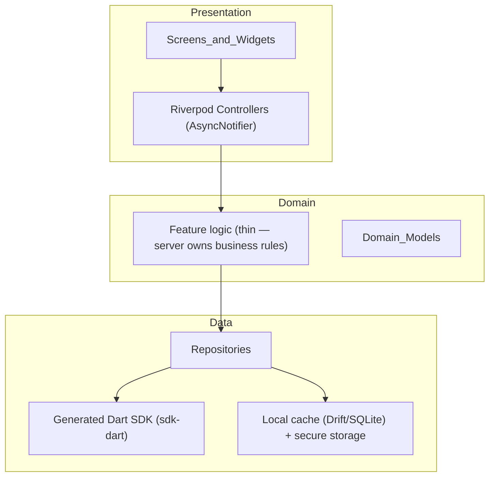
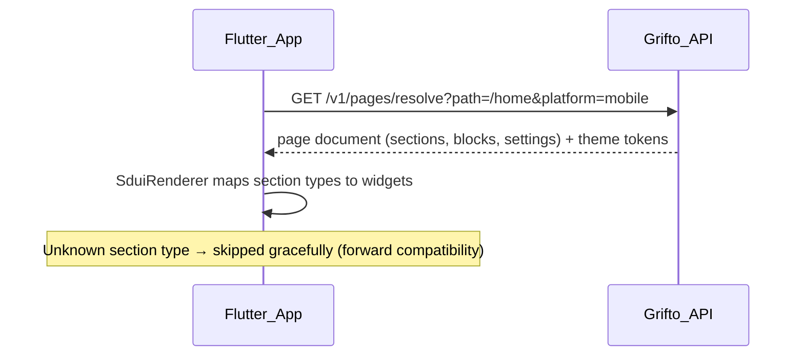

# 9. Flutter Architecture

**Goal (from the brief):** one Flutter codebase for Android + iOS, consuming the same backend APIs — auth, CMS, wishlist, wallet, notifications, products, profile, settings — with **zero backend changes** required by the mobile app.

The "zero backend changes" guarantee is structural, not aspirational: the app consumes the generated Dart SDK (`packages/sdk-dart`) produced from the same OpenAPI spec as the web SDK. If the mobile app needs an endpoint that doesn't exist, that's a platform API addition (serving all clients), never a mobile-only backend.

## 9.1 App architecture

Feature-first Clean Architecture-lite: three layers per feature, no ceremony beyond what earns its keep.

**Key stack choices:**

| Concern | Choice | Why |
|---|---|---|
| State management | **Riverpod (AsyncNotifier)** | Compile-safe DI + reactive async state; `AsyncValue` gives loading/error/data states uniformly. Bloc rejected as more boilerplate for the same outcomes at this app's complexity. |
| Navigation | **go_router** | Declarative, deep-link native (wishlist share links and notification taps must deep-link), guard-based auth redirects. |
| API client | **Generated Dart SDK** (dio-based) | Contract fidelity; interceptors handle auth header injection and refresh-token rotation. |
| Local persistence | **Drift (SQLite)** for cached lists; **flutter_secure_storage** for tokens | Offline-tolerant reads of wishlist/wallet/notifications; secure token storage in Keychain/Keystore. |
| Push | **Firebase Cloud Messaging** | Per the scope PDF; device tokens registered against the sessions/devices model (file 05). |
| Media | **cached_network_image** against CloudFront rendition URLs | Same media pipeline as web (file 11), no mobile-specific image handling server-side. |

**Business rules live on the server.** The domain layer here is intentionally thin — formatting, composition, optimistic UI. Funding math, wallet balances, fee calculation, and state transitions are never re-implemented in Dart; the app renders what the API returns. This is the "no duplicated business logic" rule applied to mobile.

## 9.2 Server-driven UI for CMS/theme content

The app has two kinds of screens:

1. **Native screens** — wishlist management, wallet, withdrawal, notifications, profile, auth. Built as Flutter widgets; product behavior identical to web because both call the same endpoints.
2. **Content screens** — home feed, campaign/landing content, FAQ, about, announcements. These render **the same theme JSON documents** the web storefront renders (file 07), via a Flutter renderer that maps section/block types to widgets.

Rules that make this safe:

- The Flutter renderer implements a **subset** of the section registry (marketing/content sections). Sections it doesn't know are skipped, so publishing a new web-only section never breaks the app.
- Theme global settings (colors, typography scale, spacing) map to a Flutter `ThemeData` bridge — brand changes in the theme editor restyle the app without release.
- Visibility rules in documents support platform targeting (`platforms: ["web","mobile"]`), so editors control what appears in-app.
- Interactive/e-commerce sections (contribution widget) are **native widget embeds** referenced by type, not HTML.

Payoff: marketing content, campaigns, FAQs, and announcements change in the admin and appear in the app instantly — no app-store review cycle for content.

## 9.3 Auth & session handling

- Tokens per file 05: access JWT in memory, refresh token in secure storage; dio interceptor refreshes on 401 with single-flight locking (concurrent requests wait on one refresh).
- Refresh-token reuse detection on the server invalidates the whole device session; the app handles `SESSION_REVOKED` by clearing state and routing to login.
- Biometric unlock (Phase 2) wraps secure storage access — no backend change.
- FCM device token lifecycle: registered on login / token rotation, deleted on logout, associated with the session row (enables the admin "Devices" view and per-device push targeting).

## 9.4 Offline & error posture

MVP posture: **read-tolerant, write-online.** Cached wishlist/wallet/notification data renders instantly with a staleness indicator; mutations require connectivity (money and reservations must not be queued client-side — conflict resolution for offline contributions is not worth the risk). Standardized error mapping: RFC 9457 problem `code` → typed Dart exceptions → user-facing messages in one lookup table.

## 9.5 Release engineering

- **Flavors:** dev / staging / prod pointing at corresponding API environments; config injected at build time (no runtime env switching in release builds).
- **CI:** GitHub Actions job (in the monorepo pipeline) — analyze, test, build appbundle/IPA on tags; Fastlane for store upload. Runs only when `apps/mobile/` or `packages/sdk-dart/` change (Turborepo-style path filters).
- **Versioning discipline:** the API's additive-only `/v1` policy (file 05) means old app versions keep working; kill-switch minimum-version check at startup via a feature-flag endpoint for the rare forced upgrade.
- **Crash reporting:** Sentry for Flutter, sharing the error-tracking pane with backend/web.

## 9.6 What Phase 1 explicitly excludes

The mobile app itself is a **Phase 2 deliverable** (roadmap in file 12) — but it costs nothing now to keep the contract mobile-ready, which is why: the SDK pipeline generates Dart from day one, the theme document format carries platform visibility flags from day one, and FCM token storage exists in the sessions schema from day one. When mobile development starts, the backend work is already done — which is the whole point.
