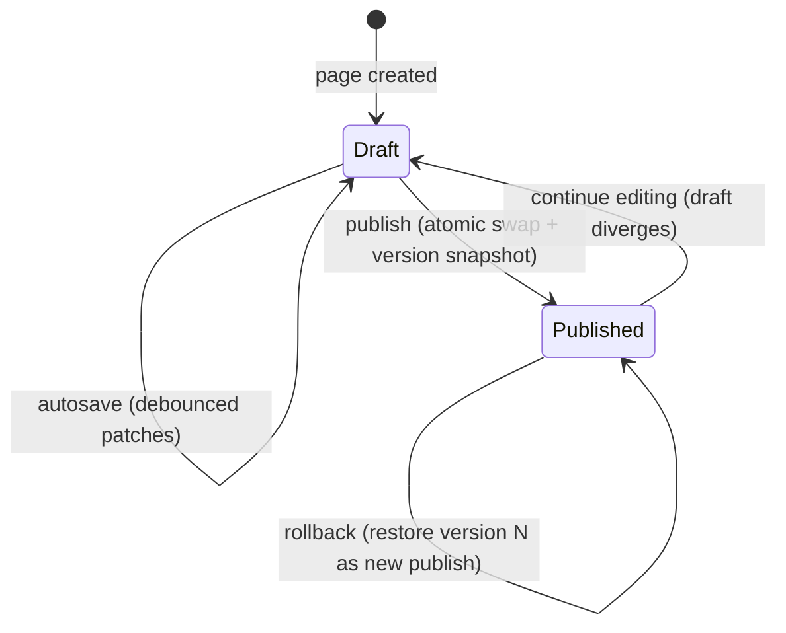
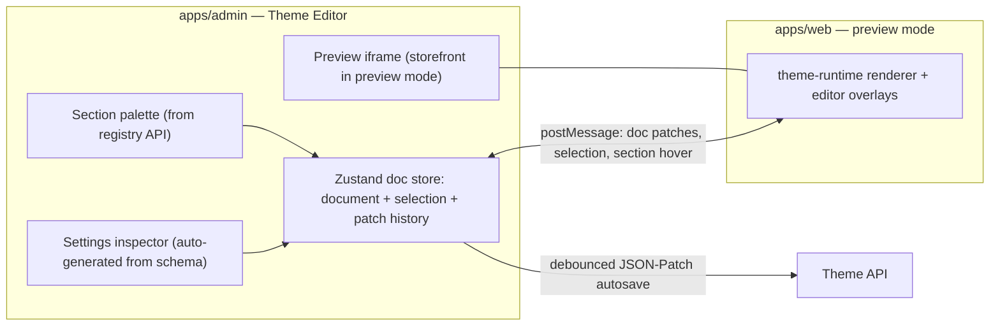
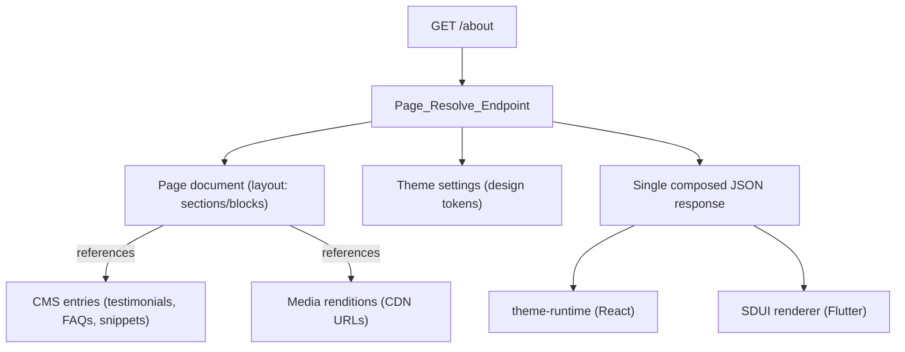

# 10. Admin Dashboard Architecture · 11. Shopify-Style Theme Builder · 12. CMS Architecture

This is the deep-dive file for the platform's hardest subsystem. The design principle throughout: **one schema-driven content engine** powers the theme editor, the CMS, and (via server-driven UI) the mobile app. The theme editor is not a feature bolted onto a CMS — the CMS is structured content *feeding* the theme engine.

---

## 10. Admin Dashboard Architecture

### 10.1 Information architecture (Shopify-inspired)

```
Admin
├── Home                     → KPI dashboard (revenue, contributions, active weddings)
├── Customers                → list, search, segments
│   └── Customer 360         → profile, wishlists, contributions, wallet, withdrawals,
│                              reservations, messages, notifications, sessions/devices,
│                              login history, unified timeline
├── Products                 → Grifto catalog CRUD, categories, import
├── Contributions            → all transactions, filters, gateway references
├── Payouts                  → withdrawal queue, approve/reject with reason
├── Revenue                  → platform fees earned, settlement views
├── Analytics                → funnels, cohorts, wishlist metrics, traffic, devices, countries
├── Notifications            → template management, broadcast announcements
├── Content (CMS)            → entries, collections, navigation, forms, SEO defaults
├── Media Library            → asset browser, folders, usage tracking
├── Online Store
│   └── Theme Editor         → full-screen editor (section 11)
│   └── Themes               → theme list, duplicate, import/export, publish
├── Settings
│   ├── General              → platform config, fee structure (fixed/percentage per PDF)
│   ├── Staff & Roles        → RBAC management (permission-based, file 05)
│   ├── API Keys             → scoped keys for public API
│   ├── Feature Flags        → flag list, per-environment toggles, % rollouts
│   ├── Developer            → webhook endpoints, logs access
│   └── System               → maintenance mode, legal pages mapping
└── Logs
    ├── Activity/Audit Logs  → who did what, before/after, filterable
    └── System Logs          → deep-link to CloudWatch/Sentry
```

### 10.2 Architectural notes

- **The admin is a pure API client.** Every admin capability is an API endpoint under `/v1/admin/*` guarded by permissions. This is what makes a future "Admin Copilot" possible: the AI calls the same endpoints with a scoped service principal (file 12). No admin-only backdoors.
- **Customer 360** is served by composite endpoints (`/v1/admin/customers/{id}/summary`, `/timeline`) that aggregate across modules *through their public services* — the admin module composes, it never joins across module tables directly.
- **Timeline** is materialized from the domain event stream (the audit/analytics subscription), so "guest contributed", "item fully funded", "withdrawal requested" appear on a customer's timeline with zero extra instrumentation.
- **Every mutating admin action produces an audit entry** (actor, permission used, entity, diff). Auditing is an event subscriber, not per-endpoint boilerplate.
- **UI foundation:** shadcn-based data tables (server-driven pagination/filter/sort via URL state), command palette (`Cmd+K`) for navigation, virtualized lists for large datasets.

---

## 11. Shopify-Style Theme Builder Architecture

### 11.1 Conceptual model (borrowed deliberately from Shopify's proven design)

| Concept | Definition |
|---|---|
| **Theme** | A named bundle: global settings (design tokens) + a set of templates + page documents. Duplicable, exportable, importable. Exactly one theme is live. |
| **Template** | A layout document for a *class* of page (`page`, `wishlist_landing`, `invitation`, `landing_page`). Data-bound pages (wishlist) use templates + dynamic data; static pages use standalone documents. |
| **Page** | A routable document instance (`/about`, `/faq`, campaign pages) with its own sections, SEO, and publish state. |
| **Section** | Top-level building block (Hero Banner, Rich Text, Testimonials, FAQ Accordion, Contribution Widget...). Has a schema, settings, and may contain blocks. Reorderable, addable, removable. |
| **Block** | Child unit inside a section (a single banner slide, a testimonial, an FAQ item). Nestable one level (matching Shopify; deeper nesting is an editor-UX trap). |
| **Component Registry** | The catalog of available section/block types with their schemas — **defined in code**, versioned, published to the DB for the editor to consume. |
| **Theme Settings** | Global design tokens: typography, color palette, spacing scale, corner radii, button styles. Rendered as CSS variables (web) and ThemeData (Flutter). |

### 11.2 Why schema-driven (and not HTML/GrapesJS-style freeform)

Freeform page builders (raw HTML/CSS canvas) produce unmaintainable output, break responsive behavior, and can't render natively in Flutter. Schema-driven building — where editors compose *typed components* whose settings are declared by developers — is why Shopify themes stay coherent under non-technical editing. Trade-off accepted: editors can only use sections developers have registered. That constraint is the feature: brand consistency, guaranteed responsiveness, mobile-renderability, and upgrade-safe documents.

### 11.3 Section schema format (the contract)

Schemas live in `packages/theme-schemas`, written as Zod schemas with editor metadata, consumed by: **API** (document validation), **admin editor** (auto-generated settings panels), **theme-runtime** (typed props), **Flutter renderer** (setting shapes). One definition, four consumers.

```typescript
// packages/theme-schemas/sections/hero-banner.ts
export const heroBannerSection = defineSection({
  type: "hero_banner",
  version: 2,                          // schema version for migrations
  name: "Hero Banner",
  icon: "image",
  maxPerPage: 1,
  settings: [
    setting.select("height", { options: ["compact", "standard", "full"], default: "standard" }),
    setting.boolean("autoplay", { default: true, label: "Auto-rotate slides" }),
    setting.range("interval", { min: 3, max: 10, unit: "s", default: 5,
                                visibleIf: { autoplay: true } }),          // conditional controls
  ],
  blocks: {
    slide: {
      name: "Slide",
      max: 4,                           // PDF: "support up to 4 banners"
      settings: [
        setting.image("image", { required: true }),
        setting.text("heading", { maxLength: 80 }),
        setting.richtext("description"),
        setting.text("ctaLabel"),
        setting.url("ctaUrl"),
      ],
    },
  },
  presets: [{ name: "Hero with one slide", blocks: [{ type: "slide" }] }],
});
```

Setting primitive types (MVP set): `text`, `richtext`, `image`, `url`, `select`, `boolean`, `range`, `color`, `font`, `spacing`, `link` (internal page picker), `product` (catalog picker), `collection`, `form` (CMS form picker). Every setting supports `visibleIf` (conditional controls) and `responsive: true` (per-breakpoint values).

### 11.4 Page document format (dynamic JSON layout)

Documents are JSONB in Postgres. Structure — template → sections (ordered) → blocks (ordered), with per-node visibility rules:

```json
{
  "schemaVersion": 1,
  "template": "page",
  "sections": [
    {
      "id": "sec_9f2k",
      "type": "hero_banner",
      "typeVersion": 2,
      "settings": { "height": "standard", "autoplay": true, "interval": 5 },
      "visibility": {
        "platforms": ["web", "mobile"],
        "breakpoints": { "mobile": true, "desktop": true },
        "rules": [{ "kind": "authState", "value": "any" }],
        "schedule": { "from": null, "until": null }
      },
      "blocks": [
        {
          "id": "blk_a1x8",
          "type": "slide",
          "settings": {
            "image": { "mediaId": "med_77ab", "alt": "Wedding celebration" },
            "heading": "Gift what they truly want",
            "ctaLabel": "Create your wishlist",
            "ctaUrl": { "kind": "internal", "path": "/register" }
          }
        }
      ]
    },
    {
      "id": "sec_h3t7",
      "type": "testimonials",
      "typeVersion": 1,
      "settings": { "heading": "Loved by couples", "source": { "kind": "cmsCollection", "collection": "testimonials", "limit": 6 } },
      "blocks": []
    }
  ],
  "seo": {
    "title": "Grifto — Wedding Gifting",
    "description": "...",
    "ogImage": { "mediaId": "med_31zz" },
    "jsonLd": { "@type": "WebSite" }
  }
}
```

Design decisions embedded here:

- **Stable node ids** (`sec_*`, `blk_*`) — undo/redo, autosave patches, and version diffs address nodes by id, so reordering doesn't confuse history.
- **`typeVersion` pinning** — when a section schema evolves, documents record which version they were authored against; registered **migration functions** upgrade settings lazily on next edit (Shopify's approach to schema drift).
- **Content by reference, not by copy** — the testimonials section *points at* a CMS collection; media settings store `mediaId`, resolved to CDN rendition URLs at render time. Editing a testimonial in the CMS updates every page using it.
- **Visibility rules** cover the brief's requirements: platform targeting (web/mobile), responsive show/hide per breakpoint, auth-state conditions, and scheduling (campaign sections that appear/disappear on dates).
- **A/B-test ready:** an optional `experiments` node (Phase 3) lets a section carry variant settings keyed by experiment id; the renderer picks a variant by bucket. The document format needs no change later — the field is specified now, implemented later.

### 11.5 Draft / publish / versioning model

Each page has **two document slots** (draft, published) plus an append-only version table:



- **Autosave:** the editor sends debounced JSON-Patch operations against the draft (not whole documents) every ~2s of idle; the API applies patches with optimistic concurrency (a `draftRevision` counter rejects stale writes — protects against two admin tabs).
- **Undo/redo:** client-side, as an inverted-patch stack in the editor's Zustand store (each applied patch stores its inverse). Undo history survives autosave because patches, not snapshots, are the unit. Depth-limited to 200 ops.
- **Publish:** one transaction — copy draft → published slot, insert immutable row in `page_versions` (full document + who + when + label), emit `page.published` (which triggers ISR revalidation, file 04).
- **Version history & rollback:** listing from `page_versions`; rollback = load version into draft (review) or publish directly. Nothing is ever destructively overwritten.
- **Preview without publishing:** signed, expiring **preview tokens** — the storefront's resolve endpoint accepts `?previewToken=` and serves the draft document with `noindex`. Editors share preview links with stakeholders before publish.

### 11.6 Editor application architecture



- **The preview is the real storefront** rendered in an iframe (`/preview?token=`), not a lookalike. This kills the classic builder failure of "editor preview ≠ published page". The iframe receives live document patches over `postMessage` and re-renders instantly (no server round-trip while editing); breakpoint toggles resize the iframe viewport (mobile/desktop preview).
- **Settings inspector is generated from schemas** — a new section type registered in code appears in the editor with a working settings panel and validation, zero editor code.
- **dnd-kit** drives three drag surfaces: palette→canvas insertion, section reordering, block reordering within sections — with keyboard accessibility and drop-target highlighting rendered by the preview overlays.
- **Asset manager / image picker** is the media library (file 11) in a modal, returning `mediaId` references.

### 11.7 Theme-level operations

- **Global theme settings** editor (typography via font picker, palette, spacing scale) writes a settings document on the theme; the storefront layout maps it to CSS variables — every section styles itself off tokens, which is what makes global restyling instant and consistent.
- **Duplicate theme:** deep-copies theme + settings + pages/templates (draft state) — the safe sandbox for redesigns; publish swaps the live theme pointer.
- **Export/import:** a theme serializes to a zip (`theme.json`, page documents, referenced media manifest). Import validates every document against the current registry (schema versions + migrations) and remaps media ids. This is also the seed format for default themes and, later, the theme-marketplace distribution format.

### 11.8 Rendering contract (web + Flutter)

`GET /v1/pages/resolve?path=/about[&previewToken=][&platform=web|mobile]` returns: resolved document (visibility rules for the platform applied server-side where possible), theme settings tokens, and denormalized content references (CMS entries, media rendition URLs) so renderers make **one** request per page. Web renders via `theme-runtime` (React, Server Components); Flutter via its SDUI renderer (file 06). Unknown section types: web fails CI (registry and runtime ship together), Flutter skips gracefully.

---

## 12. CMS Architecture

The CMS manages **structured, reusable content**; the theme engine manages **layout**. Keeping them separate (with references between) prevents both classic failure modes: content trapped inside page layouts (unfindable, unreusable) and layout crammed into content models (rigid pages).

### 12.1 Content model

- **Entry types (code-defined schemas, same Zod machinery as sections):** `testimonial`, `faq_item`, `announcement`, `campaign`, `email_template`, `push_template`, `form_definition`, `navigation_menu`, `legal_page`, `banner`, `text_snippet` (keyed UI strings for buttons/labels — the PDF's "all textual content configurable" requirement).
- **Collections** group entries (e.g., `testimonials`, `faqs`) and are what sections bind to (`source: { kind: "cmsCollection", ... }`).
- **Entries** are JSONB rows: `type`, `key`/slug, `data`, `locale` (multi-language-ready: entries carry a locale dimension from day one; MVP ships `en` only), `status` (draft/published), timestamps. Same draft/publish semantics as pages, simpler versioning (last-10 snapshots).
- **Navigation** (header/footer menus) and **forms** (contact, newsletter — field definitions + submissions inbox + notification routing) are entry types with dedicated admin UIs.
- **SEO:** global defaults (title patterns, OG image, JSON-LD organization) at CMS level; per-page overrides in page documents; sitemap and robots generated from published pages.

### 12.2 Notification templates

Email (MJML → compiled HTML) and push templates are CMS entries with typed variable declarations (`{{guestName}}`, `{{itemTitle}}`, `{{amount}}`). The notifications module validates variables against the declaration at send-enqueue time — a template edit cannot silently break sends. Which template a domain event uses is configuration, so copy changes for "Congratulations! Your wishlist item has been fully funded" never touch code.

### 12.3 How the three systems compose at request time



### 12.4 MVP cut for this subsystem (containing the risk)

| Theme editor v1 (MVP) | v2 (Phase 2+) |
|---|---|
| ~12 registered sections (hero, rich text, image+text, testimonials, FAQ, CTA, newsletter, contribution widget, invitation header, wishlist grid, footer, header) | Marketplace-grade section library |
| Draft/publish, autosave, undo/redo, version history, preview tokens, mobile/desktop preview | A/B testing, scheduled publish, theme marketplace |
| One theme + duplicate; export/import via API | Import/export UI, multi-theme management UX |
| Global settings: colors, typography, spacing | Advanced style layers, custom CSS escape hatch |

The document format, registry, and versioning model above are **final from day one** — v2 adds capability, never migration.
