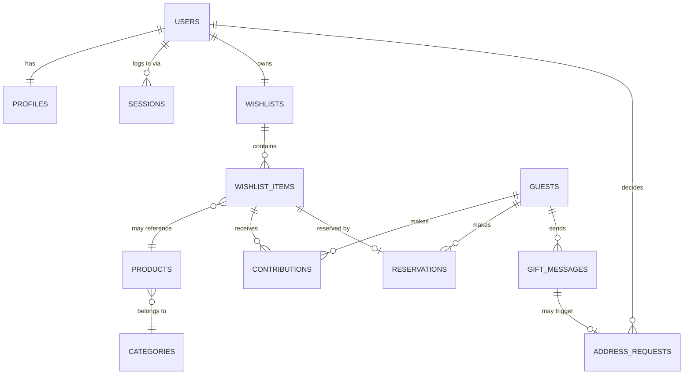
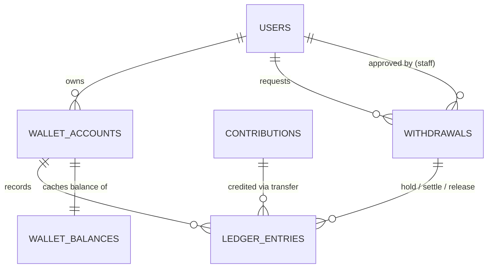
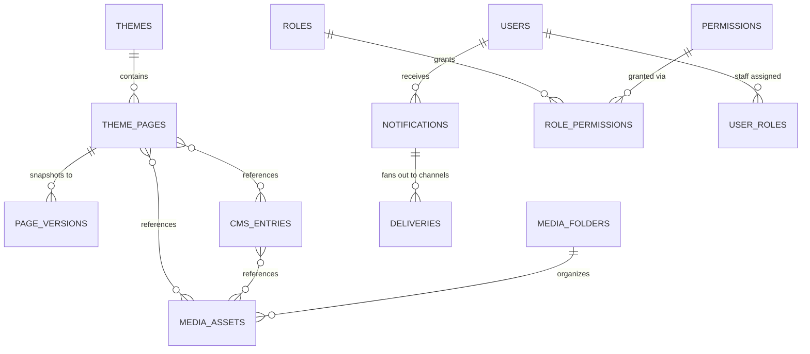

# 13. Database Design · 14. Entity Relationship Diagram

**Engine:** PostgreSQL 16 on RDS (Multi-AZ). One database, schemas-per-module naming discipline (`auth_`, `wallet_`, `theme_`, ... prefixes) so module→service extraction later means moving a table family, not untangling one.

**Global conventions**

- Primary keys: `id UUID DEFAULT gen_random_uuid()` (v7-ordered UUIDs via app for index locality).
- All tables: `created_at`, `updated_at TIMESTAMPTZ`; soft delete (`deleted_at`) **only** where business-meaningful (users, wishlist items, media) — never on ledger/audit tables.
- **Money is `BIGINT` minor units (paise)** + `currency CHAR(3)` (multi-currency-ready; MVP `INR`). Never floats, never `NUMERIC` arithmetic in app code.
- Enums as Postgres enum types for closed sets that gate logic (statuses); lookup tables where admin-editable.
- JSONB for documents and payloads; every JSONB column is validated at the API by a Zod schema before write.

---

## 13.1 Identity & access (`auth_`, `users_`)

```sql
users_users (
  id UUID PK,
  email CITEXT UNIQUE NOT NULL,
  phone TEXT NOT NULL,
  password_hash TEXT NOT NULL,             -- argon2id
  first_name TEXT NOT NULL,
  last_name TEXT NOT NULL,
  role_type user_role_type NOT NULL,       -- 'bride' | 'groom'  (PDF: Register As)
  status user_status NOT NULL DEFAULT 'active',   -- active | frozen | deleted
  token_version INT NOT NULL DEFAULT 1,    -- bump to invalidate all JWTs
  email_verified_at TIMESTAMPTZ, deleted_at TIMESTAMPTZ, ...
)

users_profiles (
  user_id UUID PK FK->users_users,
  wedding_date DATE NOT NULL,              -- PDF: Date of Marriage
  partner_name TEXT, wedding_venue TEXT,
  wedding_message TEXT, cover_media_id UUID FK->media_assets,
  avatar_media_id UUID FK->media_assets,
  address JSONB,                            -- delivery address (encrypted at column level, file 11)
  preferences JSONB NOT NULL DEFAULT '{}'   -- e.g. show_contributor_names bool (PDF: configurable attribution)
)

auth_sessions (
  id UUID PK, user_id UUID FK,
  refresh_token_hash TEXT NOT NULL,
  family_id UUID NOT NULL,                 -- rotation family for reuse detection
  device_name TEXT, device_type TEXT, user_agent TEXT, ip INET,
  fcm_token TEXT,                          -- push target for this device
  last_used_at TIMESTAMPTZ, revoked_at TIMESTAMPTZ, expires_at TIMESTAMPTZ NOT NULL
)
-- login history = append-only auth_login_events(user_id, ip, ua, success, created_at)

rbac_roles (id, name UNIQUE, description, is_system BOOL)
rbac_permissions (id, key UNIQUE)               -- 'payouts.approve', seeded from code
rbac_role_permissions (role_id FK, permission_id FK, PK(role_id, permission_id))
rbac_user_roles (user_id FK, role_id FK, PK(user_id, role_id))   -- staff/admin users only

api_keys (id, name, key_hash, prefix, scopes TEXT[], created_by FK, last_used_at, revoked_at)
```

## 13.2 Guests, wishlists, gifting (`guests_`, `wishlist_`)

```sql
guests_guests (
  id UUID PK,
  full_name TEXT NOT NULL, email CITEXT NOT NULL,   -- PDF: guest identification
  UNIQUE (email)                                     -- returning-guest prefill
)

wishlist_wishlists (
  id UUID PK, user_id UUID FK UNIQUE,       -- one wishlist per bride/groom (MVP; drop UNIQUE for multi-event future)
  title TEXT, share_slug TEXT UNIQUE NOT NULL,      -- public URL + QR target
  qr_media_id UUID FK->media_assets,        -- generated hi-res QR asset
  status wishlist_status DEFAULT 'active'
)

wishlist_items (
  id UUID PK, wishlist_id UUID FK,
  source item_source NOT NULL,              -- 'manual' | 'url' | 'catalog'
  product_id UUID FK->catalog_products NULL,       -- when source='catalog'
  title TEXT NOT NULL,
  image_media_id UUID FK NULL,
  product_url TEXT NULL,
  price_minor BIGINT NOT NULL CHECK (price_minor > 0),
  currency CHAR(3) NOT NULL DEFAULT 'INR',
  funded_minor BIGINT NOT NULL DEFAULT 0,   -- denormalized cache; ledger is truth (13.4)
  status item_status NOT NULL DEFAULT 'open',
        -- 'open' | 'partially_funded' | 'fully_funded' | 'reserved'
  sort_order INT, deleted_at TIMESTAMPTZ
)

wishlist_reservations (                      -- "I'm bringing this gift"
  id UUID PK, item_id UUID FK UNIQUE,        -- one active reservation per item
  guest_id UUID FK, consent_at TIMESTAMPTZ NOT NULL,
  status reservation_status DEFAULT 'active' -- active | cancelled
)

gift_messages (                              -- "Send gift after wedding" love notes
  id UUID PK, item_id UUID FK, guest_id UUID FK,
  message TEXT, consent_at TIMESTAMPTZ NOT NULL
)

address_requests (
  id UUID PK, gift_message_id UUID FK, guest_id UUID FK, user_id UUID FK,
  status address_request_status DEFAULT 'pending',  -- pending | approved | rejected
  decided_at TIMESTAMPTZ, decided_reason TEXT
)
```

## 13.3 Catalog (`catalog_`)

```sql
catalog_categories (id, parent_id FK NULL, name, slug UNIQUE, sort_order, is_active)
catalog_products (
  id UUID PK, category_id UUID FK,
  title TEXT NOT NULL, slug TEXT UNIQUE, description TEXT,
  price_minor BIGINT NOT NULL, currency CHAR(3),
  image_media_id UUID FK, gallery JSONB,     -- [mediaId,...]
  attributes JSONB DEFAULT '{}',             -- flexible product attributes
  status product_status DEFAULT 'active',
  search_tsv TSVECTOR GENERATED               -- Postgres FTS (MVP search)
)
```

## 13.4 Money: payments, ledger wallet, withdrawals (`pay_`, `wallet_`)

Full behavioral design in file 09; the schema:

```sql
pay_contributions (
  id UUID PK,
  item_id UUID FK, wishlist_id UUID FK, guest_id UUID FK,
  amount_minor BIGINT NOT NULL CHECK (amount_minor > 0), currency CHAR(3),
  status contribution_status NOT NULL DEFAULT 'pending',
        -- pending | paid | failed | expired
  gateway_order_id TEXT, gateway_payment_id TEXT UNIQUE,   -- gateway Transaction ID
  gateway_payload JSONB,                     -- raw verified webhook payload (forensics)
  idempotency_key TEXT UNIQUE NOT NULL,
  paid_at TIMESTAMPTZ
)

wallet_accounts (
  id UUID PK, owner_type ledger_owner NOT NULL,  -- 'user' | 'platform_fees' | 'gateway_clearing'
  owner_id UUID NULL,                        -- user_id when owner_type='user'
  currency CHAR(3) NOT NULL,
  UNIQUE (owner_type, owner_id, currency)
)

wallet_ledger_entries (                      -- append-only. No UPDATE, no DELETE (enforced by trigger + role grants)
  id BIGINT GENERATED ALWAYS AS IDENTITY PK,
  transfer_id UUID NOT NULL,                 -- groups the debit+credit pair
  account_id UUID FK NOT NULL,
  direction entry_direction NOT NULL,        -- 'debit' | 'credit'
  amount_minor BIGINT NOT NULL CHECK (amount_minor > 0),
  entry_type ledger_entry_type NOT NULL,     -- contribution_credit | withdrawal_debit | fee_debit | hold | hold_release | adjustment
  reference_type TEXT, reference_id UUID,    -- contribution / withdrawal linkage
  created_at TIMESTAMPTZ NOT NULL DEFAULT now()
)

wallet_balances (                            -- materialized cache, rebuildable from entries
  account_id UUID PK FK,
  available_minor BIGINT NOT NULL DEFAULT 0,
  held_minor BIGINT NOT NULL DEFAULT 0,
  as_of_entry_id BIGINT NOT NULL,
  CHECK (available_minor >= 0 AND held_minor >= 0)
)

wallet_withdrawals (
  id UUID PK, user_id UUID FK, account_id UUID FK,
  gross_minor BIGINT NOT NULL, fee_minor BIGINT NOT NULL, net_minor BIGINT NOT NULL,
  fee_config_snapshot JSONB NOT NULL,        -- fee rule as of request time (auditability)
  bank_details_encrypted BYTEA NOT NULL,     -- KMS envelope-encrypted {holder, bank, account, ifsc}
  status withdrawal_status NOT NULL DEFAULT 'pending_approval',
        -- pending_approval | approved | processing | completed | rejected | payout_failed
  hold_transfer_id UUID NOT NULL,            -- ledger hold linkage
  gateway_payout_id TEXT UNIQUE NULL,
  decided_by UUID FK NULL, decided_at TIMESTAMPTZ, rejection_reason TEXT,
  idempotency_key TEXT UNIQUE NOT NULL
)
```

## 13.5 Notifications (`notif_`)

```sql
notif_notifications (
  id UUID PK, user_id UUID FK,
  type TEXT NOT NULL,                        -- 'contribution.received', 'item.fully_funded', ...
  title TEXT, body TEXT,
  payload JSONB,                             -- deep-link data {itemId, contributionId,...}
  read_at TIMESTAMPTZ, archived_at TIMESTAMPTZ,
  created_at TIMESTAMPTZ
) PARTITION BY RANGE (created_at);            -- monthly partitions

notif_deliveries (id, notification_id FK NULL, channel notif_channel, -- in_app | email | push
  recipient TEXT, template_key TEXT, status delivery_status,          -- queued|sent|failed|bounced
  provider_message_id TEXT, error TEXT, sent_at TIMESTAMPTZ)
```

## 13.6 Theme engine & CMS (`theme_`, `cms_`)

```sql
theme_themes (id, name, is_live BOOL, settings JSONB NOT NULL,   -- design tokens document
              source theme_source DEFAULT 'custom', created_by FK)
              -- exactly-one-live enforced by partial unique index ON (is_live) WHERE is_live

theme_registry_versions (id, registry JSONB NOT NULL, app_version TEXT, published_at)
              -- snapshot of code-defined section schemas per deploy (editor consumes latest)

theme_pages (
  id UUID PK, theme_id UUID FK,
  kind page_kind NOT NULL,                   -- 'page' | 'template'
  path TEXT NULL,                            -- '/about' (pages) ; NULL for templates
  template_key TEXT NULL,                    -- 'wishlist_landing' etc (templates)
  draft_document JSONB NOT NULL,             -- sections/blocks doc (file 07 format)
  draft_revision INT NOT NULL DEFAULT 0,     -- optimistic concurrency for autosave
  published_document JSONB NULL,
  status page_status DEFAULT 'draft',        -- draft | published
  published_at TIMESTAMPTZ,
  UNIQUE (theme_id, path)
)

theme_page_versions (id, page_id FK, document JSONB NOT NULL, label TEXT,
                     created_by FK, created_at)     -- append-only history / rollback

cms_entries (
  id UUID PK, type TEXT NOT NULL,            -- 'testimonial'|'faq_item'|'form_definition'|...
  key TEXT, collection TEXT, locale TEXT DEFAULT 'en',
  data JSONB NOT NULL,
  status entry_status DEFAULT 'draft', published_data JSONB,
  UNIQUE (type, key, locale)
)
cms_form_submissions (id, form_key, data JSONB, source_path, created_at)  -- contact / newsletter
```

## 13.7 Media (`media_`)

```sql
media_assets (
  id UUID PK, folder_id UUID FK NULL,
  kind media_kind,                           -- image | video | document | qr
  original_key TEXT NOT NULL,                -- S3 key
  filename TEXT, mime TEXT, bytes BIGINT, width INT, height INT,
  alt TEXT, blurhash TEXT,
  renditions JSONB,                          -- {webp_800: key, avif_1600: key, ...}
  uploaded_by_type TEXT, uploaded_by UUID,   -- admin | user | system
  status media_status DEFAULT 'processing',  -- processing | ready | failed
  deleted_at TIMESTAMPTZ
)
media_folders (id, parent_id FK NULL, name)
```

## 13.8 Platform: analytics, audit, flags, settings, outbox

```sql
analytics_events (
  id BIGINT IDENTITY, occurred_at TIMESTAMPTZ NOT NULL,
  event_name TEXT NOT NULL,                  -- wishlist.viewed, contribution.completed,...
  actor_type TEXT, actor_id UUID,
  session_key TEXT, device TEXT, country TEXT, referrer TEXT, utm JSONB,
  properties JSONB
) PARTITION BY RANGE (occurred_at);           -- monthly; old partitions → S3/Parquet (Phase 2)

audit_logs (
  id BIGINT IDENTITY, occurred_at TIMESTAMPTZ,
  actor_type TEXT NOT NULL, actor_id UUID,   -- staff user | api key | system
  action TEXT NOT NULL,                      -- 'payout.approved'
  entity_type TEXT, entity_id UUID,
  before JSONB, after JSONB, ip INET, trace_id TEXT
) PARTITION BY RANGE (occurred_at);           -- append-only, INSERT-only role grants

feature_flags (key PK, description, enabled BOOL, rules JSONB,   -- % rollout, per-env, per-role
               updated_by FK, updated_at)

platform_settings (key PK, value JSONB, updated_by FK, updated_at)
  -- 'withdrawal_fee': {"kind":"percentage","value":5,"min_minor":1000}   (PDF: admin-configurable fees)

event_outbox (id BIGINT IDENTITY, event_name TEXT, payload JSONB, occurred_at,
              published_at TIMESTAMPTZ NULL)   -- transactional outbox (file 02)

idempotency_keys (key PK, request_hash TEXT, response JSONB, status, expires_at)
```

## 13.9 Future-reserved schemas (defined now, built later)

```sql
ai_memories (id, subject_type, subject_id, kind, content TEXT,
             embedding VECTOR(1536), metadata JSONB, created_at)    -- pgvector
ai_conversations (id, user_id, agent TEXT, created_at)
ai_messages (id, conversation_id FK, role TEXT, content JSONB, tokens INT, created_at)
chat_threads (id, wishlist_id, participant_a, participant_b, created_at)      -- future chat
chat_messages (id, thread_id FK, sender_type, sender_id, body, media_id, created_at)
```

Reserving these as designed-but-unbuilt keeps Phase 2 features from inventing conflicting models under deadline pressure.

---

## 14. Entity relationship diagrams

### Core gifting domain



### Money domain



### Content & platform domain



---

## 13.10 Normalization & denormalization policy

3NF for identity, money, and gifting relations. Deliberate denormalizations, each with a stated reconciliation source of truth:

| Denormalized field | Truth source | Sync mechanism |
|---|---|---|
| `wishlist_items.funded_minor` / `status` | SUM of paid contributions | Updated in the payment-verified transaction; nightly reconciliation job cross-checks |
| `wallet_balances` | `wallet_ledger_entries` | Updated in the same TX as entries; rebuildable by replay |
| `theme_pages.published_document` | `theme_page_versions` latest publish | Written atomically at publish |
| `renditions` on media | S3 listing | Written by media worker on completion |

JSONB is used where the shape is a *document* (page layouts, settings, payloads) — not as an excuse to skip modeling relations that get queried/joined (contributions, entries-by-collection are real columns, not JSON).

## 13.11 Indexing strategy

- FK columns: btree indexes everywhere (Postgres doesn't auto-index FKs).
- Hot paths: `wishlists(share_slug)` unique (guest journey entry), `contributions(gateway_payment_id)` unique (webhook idempotency), `ledger_entries(account_id, id)` (balance replay), `notifications(user_id, created_at DESC) WHERE read_at IS NULL` partial (badge counts), `withdrawals(status) WHERE status='pending_approval'` partial (admin queue).
- JSONB: GIN on `analytics_events.properties` and `cms_entries.data` (jsonb_path_ops); expression indexes for known keys beat blanket GINs — added per observed query.
- Search: `catalog_products.search_tsv` GIN (MVP search); `ai_memories.embedding` HNSW (when AI ships).
- Review cadence: `pg_stat_statements` monthly; no speculative indexes (write amplification on ledger/notifications matters).

## 13.12 Caching (summary — full strategy in file 11)

Redis layers on top: resolved page documents (invalidated by publish events), public wishlist payloads (invalidated by contribution/reservation events), session/token-version checks, rate-limit buckets, catalog queries. **Nothing in the money path is served from cache** — wallet and withdrawal reads always hit Postgres.

## 13.13 Partitioning & data lifecycle

- Range-partitioned by month: `analytics_events`, `audit_logs`, `notif_notifications` (+ `notif_deliveries`). These are the only unbounded-growth tables; partition pruning keeps queries fast and makes retention = detach/archive partition.
- Retention: analytics raw 13 months in PG (aggregates kept), then Parquet on S3; audit logs 7 years (financial platform posture) — old partitions to S3 with Athena queryability; notifications 12 months unless user-archived.
- Ledger and contributions are **never** partitioned away or purged — they are bounded by real transaction volume and are the audit substrate.

## 13.14 Backup & recovery

- RDS automated backups, PITR window 14 days; daily snapshots retained 35 days; monthly snapshots to a second region (DR).
- `pg_dump` logical export weekly to S3 (protection against engine-level corruption class that snapshots inherit).
- Restore drill quarterly: RPO ≤ 5 min (PITR), RTO ≤ 1 hour (documented runbook). DR plan in file 10.

## 13.15 Scalability path

1. **Now:** single Multi-AZ instance (db.t4g.medium), pgBouncer-style pooling via RDS Proxy when Lambda/media workers arrive.
2. **Read pressure:** read replica; analytics/admin reporting queries pinned to replica via a read-only Drizzle client.
3. **Analytics outgrows OLTP:** stream `analytics_events` (already event-sourced via outbox) to S3/ClickHouse; PG keeps 90-day hot window.
4. **Module extraction:** table-prefix families move with their module (file 02); ledger likely last — it benefits most from single-DB transactional integrity.
5. **Sharding:** not on the horizon; a wedding-gifting workload is comfortably single-writer for years. Multi-tenancy (Phase 3 white-label) arrives as `tenant_id` columns + RLS policies, designed into new tables from Phase 2 onward.
