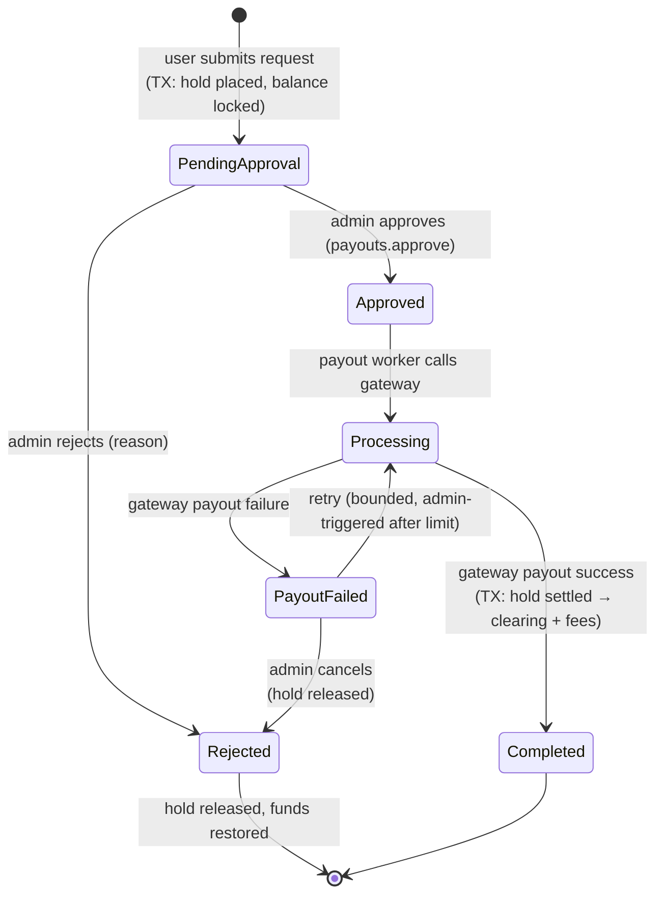

# 24. Payment Architecture · 25. Wallet Architecture

Money is where this platform earns trust or dies. Three design commitments govern everything in this file:

1. **The ledger is the truth.** Balances are derived; entries are append-only; every state is reconstructable.
2. **Every money-moving operation is idempotent.** Webhooks retry, users double-click, networks flake — none of that may move money twice.
3. **State machines, not booleans.** Contributions and withdrawals move through explicit states with defined transitions; illegal transitions are DB-constraint violations, not code-review hopes.

---

## 24. Payment architecture

### 24.1 Gateway integration model

The scope PDF specifies a payment gateway **owned by the Product Owner** handling both collections (guest contributions) and payouts (withdrawals). The architecture treats it behind a `PaymentGatewayPort` interface (file 05) with a Razorpay-compatible adapter shape (`createOrder`, `verifyWebhookSignature`, `createPayout`, `getPayoutStatus`), so the specific gateway — or a second one later — is an adapter, not an architecture change.

### 24.2 Contribution flow (collection)

```mermaid
sequenceDiagram
    participant G as Guest
    participant W as Storefront
    participant P as Payments_Module
    participant GW as Gateway
    participant DB as Postgres_TX
    participant Q as Workers

    G->>W: Contribute ₹X to item
    W->>P: POST /v1/contributions {itemId, amount, guestToken, Idempotency-Key}
    P->>P: validate item is open (not fully funded / reserved — PDF rule)
    P->>DB: INSERT contribution status=pending
    P->>GW: create order (amount, contribution id as receipt)
    P-->>W: gateway order params → checkout popup
    G->>GW: pays
    GW-->>P: webhook payment.captured (HMAC signed)
    P->>P: verify signature + timestamp; lookup by gateway_payment_id (idempotent)
    P->>DB: ONE TRANSACTION:<br/>contribution pending→paid;<br/>ledger transfer (24.4);<br/>item funded_minor += X, status recompute;<br/>outbox: payment.verified
    Q->>Q: notifications, analytics, receipt email
    Note over P,GW: Poll fallback: pending contributions older than 15 min<br/>are re-checked against gateway API, then paid or expired
```

Design points:

- **Webhook is the commit signal, not the browser redirect.** The client success callback only optimistically refreshes UI; money state changes exclusively on verified webhooks (or the reconciliation poller). A guest closing the tab mid-payment loses nothing.
- **Idempotency, twice over:** client-supplied `Idempotency-Key` dedupes contribution creation; unique `gateway_payment_id` dedupes webhook processing. Replayed webhooks return 200 and do nothing.
- **Overfunding guard:** the verified-payment transaction re-reads the item `FOR UPDATE`; a contribution that would exceed the remaining amount on a now-fully-funded item is accepted as money (it was captured) but flagged `overfunded=true` for the couple's wallet anyway — business rule per PDF ("additional contributions restricted based on business rules") enforced primarily at order-creation time, with the race window resolved in the couple's favor rather than by refund complexity at MVP.
- **Failure paths:** signature mismatch → 401 + alert (possible attack); `payment.failed` webhook → contribution `failed`, guest sees retry UI; gateway timeout at order creation → contribution stays `pending`, safe to retry with the same idempotency key.

### 24.3 Fees

Platform fees are charged **at withdrawal**, not at contribution (per the PDF: guests' full amounts credit the wallet; the service fee is deducted during redemption). Fee rules live in `platform_settings` (`fixed`, `percentage`, or both with a minimum), editable in the admin with audit logging. Every withdrawal snapshots the fee config it was computed under (`fee_config_snapshot`) so historical withdrawals remain explainable after fee changes.

### 24.4 The double-entry model

Every movement is a **transfer**: equal debit + credit entries sharing a `transfer_id`. Accounts (file 08): one per user-wallet, plus platform accounts (`gateway_clearing`, `platform_fees`).

| Event | Debit | Credit |
|---|---|---|
| Contribution verified | `gateway_clearing` | user wallet (available) |
| Withdrawal requested (hold) | user wallet available | user wallet held |
| Withdrawal completed | user wallet held (net + fee) | `gateway_clearing` (net) + `platform_fees` (fee) |
| Withdrawal rejected (release) | user wallet held | user wallet available |
| Manual adjustment (support) | per case, always dual-entry, always audited |

Invariants, enforced by construction and checked by reconciliation:

- Sum of debits = sum of credits per `transfer_id` (CHECKed at write).
- `wallet_balances.available_minor ≥ 0` and `held_minor ≥ 0` (DB CHECK).
- Balance cache equals entry replay (nightly job recomputes and alerts on drift — drift is a sev-1).
- Gateway settlement reports reconcile against `gateway_clearing` (the PDF scopes bank settlement outside the app, but the clearing account makes the platform's books match the gateway's).

## 25. Wallet architecture

### 25.1 Wallet reads

`GET /v1/wallet` returns: available balance, held balance, total received (lifetime credits), and paginated transaction history — all straight from `wallet_balances` + `wallet_ledger_entries` (presented through a human-readable projection: "Contribution from Asha — ₹5,000"). No cache in this path (file 08).

### 25.2 Withdrawal state machine (with the PDF's locking mechanism)



**Request (one transaction):**

1. `SELECT ... FOR UPDATE` on the wallet balance row — serializes concurrent withdrawal attempts (the PDF's duplicate-withdrawal prevention).
2. Validate `available ≥ requested`; compute fee from current config; write `fee_config_snapshot`.
3. Ledger hold transfer: available → held for the gross amount. Available becomes ₹0 for a full-balance withdrawal, exactly as the PDF specifies (partial withdrawals: same mechanics, smaller hold — future-enabled by design).
4. Insert withdrawal `pending_approval`; encrypt bank details (KMS envelope); outbox `withdrawal.requested` (admin notification + queue badge).

**Approve/reject (admin, audited):** approval flips state and enqueues the payout job; rejection releases the hold in the same transaction that records the rejection + reason — funds reappear instantly, matching the PDF's rejection behavior.

**Payout execution (worker):** idempotent gateway payout call (withdrawal id as gateway idempotency reference); on confirmed success, the settle transaction splits the hold into net (clearing) + fee (platform fees) and marks `completed`; user gets notified on every transition. Gateway payouts are verified by webhook/polling, not assumed from the API call returning.

### 25.3 Why not a `balance` column with ± updates

It's simpler right up until: a crash between "deduct balance" and "record withdrawal"; support asks "why is this balance ₹3,200?"; an auditor asks for money movement history; a race double-spends a withdrawal; or a refund/adjustment needs to be layered on. The ledger design costs roughly two tables and one discipline ("never write one-sided entries") and answers all of those structurally. For a platform whose entire product is holding other people's wedding money, this is the minimum responsible design — not gold-plating.

### 25.4 Money-path testing requirements

- Property test: random interleavings of contributions/withdrawals/rejections never violate ledger invariants.
- Concurrency test: N parallel withdrawal requests against one wallet → exactly one succeeds.
- Webhook replay/out-of-order tests; payout retry idempotency tests.
- A staging "chaos" job that randomly kills the worker mid-payout, asserting recovery to a consistent state.
