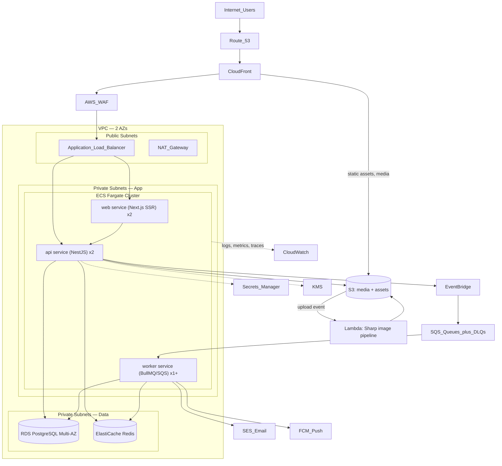
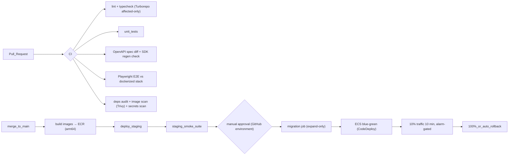

# 18. AWS Infrastructure · 19. DevOps Pipeline · 31. Estimated Infrastructure Cost

## 18.1 Infrastructure diagram

## 18.2 Service-by-service decisions (the brief's checklist)

| Service | Decision | Reasoning |
|---|---|---|
| **CloudFront** | Yes, MVP — in front of both apps and media | Caches ISR pages + media at edge; guests scan QR codes on mobile networks; also the TLS/HTTP3 front door |
| **S3** | Yes, MVP | Media originals + renditions, theme export bundles, log/analytics archives, DB logical dumps |
| **API Gateway vs ALB** | **ALB** for the platform API; API Gateway deferred to the public-API phase | ALB is cheaper at sustained traffic, sufficient for path routing + health checks. API Gateway earns its cost when third-party keys need usage plans/throttling per key (Phase 3); rate limiting until then is Redis in-app |
| **EC2 vs ECS vs EKS** | **ECS Fargate** | vs EC2 (PDF proposal): no patching/AMIs/capacity planning; deploys, rollbacks, autoscaling are managed. vs EKS: no control-plane cost or K8s skill tax. Containers keep every future door open |
| **RDS PostgreSQL** | Yes — Multi-AZ from day one | Single-AZ saves ~₹2k/month and risks the money database; not a trade worth making. db.t4g.medium start |
| **Redis (ElastiCache)** | Yes, MVP (single node t4g.micro → replica later) | Required by BullMQ jobs, sessions, rate limits — not optional caching (deviation from PDF, argued in file 00) |
| **Lambda** | Media image pipeline only | Bursty, event-driven, stateless — the one workload that fits Lambda better than the always-on services |
| **SES** | Yes, MVP | All transactional email; MJML-compiled templates; bounce/complaint handling wired to `notif_deliveries` |
| **SNS** | Only as SES bounce/complaint topic + CloudWatch alarm fan-out | App push goes via FCM (PDF choice, correct one); SNS mobile push adds nothing here |
| **SQS** | Yes, MVP — one queue per consumer group + DLQs | Domain-event delivery from EventBridge to workers; DLQ depth alarms |
| **EventBridge** | Yes, MVP — the event bus (outbox relay target) | Rule-based fan-out to SQS; later consumers (analytics stream, plugins, AI) subscribe without producer changes; also cron rules for scheduled jobs |
| **Secrets Manager** | Yes — DB creds, gateway keys, JWT signing keys | Injected into task definitions; no secrets in env files or images |
| **CloudWatch** | Yes — logs (structured JSON), metrics, alarms, dashboards | Plus Sentry (errors) and OTel traces (X-Ray or Grafana Cloud later) |
| **OpenSearch** | **No at MVP** — Postgres FTS carries catalog search | ~₹7k+/month minimum for a t3.small domain; adopt at the trigger defined in file 11 |
| **IAM** | Task roles per service, least privilege (api can't touch payout secrets; worker can) | Human access via SSO roles, no long-lived keys |
| **KMS** | CMKs for RDS/S3 encryption + envelope encryption of bank details | Key rotation on; bank-detail decrypt permission restricted to the payout worker role |
| **WAF** | Yes, MVP (managed rule sets + rate rules on auth/payment/guest endpoints) | The platform handles money and will be probed; ₹1.8k/month was already budgeted in the PDF |
| **Shield** | Standard (free, automatic). Advanced: no | Shield Advanced is ₹2.5L+/month — enterprise-scale insurance, absurd at MVP |
| **Auto Scaling** | ECS service auto-scaling: api/web on CPU + ALB RPS; worker on SQS depth + queue latency | Wedding traffic is spiky (invitation sends cause QR bursts); scale-out policies tested in staging |
| **Backup** | RDS PITR 14d + snapshots 35d + monthly cross-region; S3 versioning + replication for media | Detailed in file 08 |
| **Disaster recovery** | Warm-standby-lite: Terraform can rebuild the stack in a second region in ~1h; data already replicated (snapshots + S3 CRR). RPO ≤ 15 min cross-region, RTO ≤ 4h | Full active-active is Phase 3 posture |
| **Cost optimization** | Fargate ARM (Graviton), t4g instance family, S3 lifecycle to IA/Glacier, savings plan after 3 months of stable baseline, CloudFront caching discipline, budget alarms at 80/100% | Reviewed monthly against the budget below |

## 19. DevOps pipeline

### 19.1 Environments

| Env | Purpose | Infra |
|---|---|---|
| **local** | Feature development | docker-compose: PG, Redis, LocalStack, Mailpit (file 03) |
| **staging** | Integration, E2E, gateway sandbox, chaos tests | Scaled-down copy of prod (single-AZ RDS, 1 task per service), same Terraform modules |
| **production** | Live | As diagrammed |

Preview deploys for frontend PRs (Vercel preview or ephemeral ECS task) against staging API — cheap and invaluable for reviewing theme-editor work visually.

### 19.2 CI/CD (GitHub Actions)

- **Blue-green:** ECS + CodeDeploy deploys the new task set alongside the old, shifts 10% via ALB, watches CloudWatch alarms (5xx rate, latency, DLQ depth), then completes or rolls back automatically. Worker service uses rolling deploys with queue-drain (SIGTERM → finish in-flight jobs → exit).
- **Migrations: expand/contract.** Deploys only run additive migrations before code; destructive steps (drop column) ship in a later release after code no longer references the old shape. This is what makes blue-green safe with one database.
- **Terraform:** all infra in `infra/terraform`, state in S3 + DynamoDB locking, `plan` posted on PRs touching infra, `apply` gated by the same environment approvals. No console changes — drift detection weekly.
- **Feature flags:** DB-backed flags (file 08) with a typed SDK accessor and admin UI; percentage rollouts and per-role targeting. Deploy ≠ release: risky features (theme editor v1, payout automation) ship dark and open gradually. LaunchDarkly-class tooling is unnecessary spend at this scale.
- **Secrets:** GitHub OIDC → AWS roles (no stored cloud keys in CI); runtime secrets only from Secrets Manager.

### 19.3 Monitoring, logging, alerting

- **Structured JSON logs** with `traceId` propagated from the edge (CloudFront request id) through API, workers, and outbox events — one id follows a contribution from click to email.
- **Golden signals + domain alarms:** p95 latency, 5xx rate, DB connections/CPU, Redis memory, queue depth/age, **payout-failure count ≥ 1** (pages a human), **ledger reconciliation drift ≠ 0** (sev-1), webhook signature failures (possible attack), SES bounce rate.
- **Dashboards:** infra (CloudWatch), errors/releases (Sentry), product KPIs (admin analytics — the business's own dashboard, not CloudWatch's job).
- On-call: PagerDuty-free at MVP — CloudWatch → SNS → phone/Slack; upgrade when the team grows.

## 31. Estimated infrastructure cost

### MVP (launch → early traction), monthly, ap-south-1, ₹

| Item | Spec | ₹ / month |
|---|---|---|
| ECS Fargate — web + api | 2 + 2 tasks, 0.5 vCPU / 1GB, ARM | 4,400 |
| ECS Fargate — worker | 1 task, 0.5 vCPU / 1GB | 1,100 |
| RDS PostgreSQL | db.t4g.medium **Multi-AZ**, 50GB gp3 | 5,800 |
| ElastiCache Redis | cache.t4g.micro | 1,100 |
| ALB | base + modest LCU | 1,900 |
| CloudFront + Route 53 | low TB egress + DNS | 800 |
| S3 (+ lifecycle) | media + backups, ~100GB | 400 |
| SQS + EventBridge | MVP volumes | 300 |
| SES | ~50k emails | 450 |
| Lambda (image pipeline) | bursty | 150 |
| WAF | managed rules + 2 rate rules | 1,700 |
| Secrets Manager + KMS | ~10 secrets, 2 CMKs | 500 |
| CloudWatch (logs + alarms + dashboards) | 10GB logs | 900 |
| ECR, misc | | 300 |
| **Total** | | **≈ ₹19,800** |

Honest reconciliation with the PDF's ₹15–18k estimate: this lands ~10–15% above it, and the delta buys Multi-AZ on the money database, blue-green deploys, and a worker tier — the PDF's own number also assumed a single EC2 box doing everything. Dropping Multi-AZ (−₹2.9k) and halving web tasks (−₹1.1k) reaches ₹15.8k if the budget is hard, at explicitly documented risk. Staging adds ~₹6–7k (single-AZ, one task each, shut down nightly by schedule to roughly halve that).

### Growth posture (Phase 2: mobile launch, ~50k MAU)

Scale the same shapes: api/web 4–6 tasks, db.r6g.large + read replica, Redis with replica, OpenSearch t3.small (if triggered), higher egress — lands ≈ ₹55–75k/month. Cost per additional user falls steeply; the architecture has no step-function rewrites hiding in it, only bigger numbers on the same Terraform variables.
