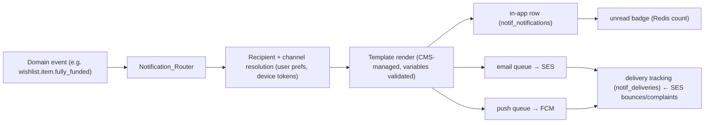
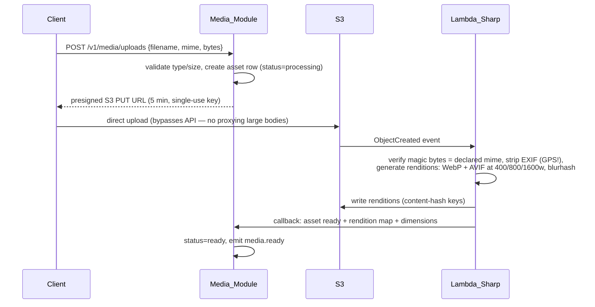

# 20. Security · 21. Caching Strategy · 22. Search · 23. Notifications · 26. Media Management

## 20. Security architecture

Authentication, session management, RBAC, and API-key scoping are specified in file 05; infrastructure controls (WAF, Shield, IAM, KMS, Secrets Manager, network segmentation) in file 10. This section covers the remaining posture.

### 20.1 Application controls

- **Rate limiting** (Redis token buckets): per-IP on anonymous routes with strict buckets on login (brute force), guest identification (enumeration/spam), and contribution creation; per-user on authenticated routes; per-key on the public API. 429s with `Retry-After`.
- **CSRF:** httpOnly cookies + `SameSite=Lax` cover navigation-based CSRF; state-changing storefront requests additionally carry a double-submit token. Bearer-token clients (Flutter, API keys) are CSRF-immune by construction.
- **CORS:** explicit allowlist (web, admin origins); no wildcards; credentials only for first-party origins. Public API uses keys, not cookies, so it needs no CORS relaxation.
- **Input validation:** every request body/query passes a Zod schema at the controller boundary (shared with frontend forms). JSONB documents (theme, CMS) validate against registry schemas before persistence — a compromised admin session cannot inject arbitrary structures.
- **XSS:** React escaping by default; rich-text CMS fields are sanitized server-side (allowlist HTML) at save **and** render; theme documents carry structured settings, never raw HTML/JS (the schema-driven design is itself the XSS control for the page builder). CSP: `default-src 'self'` + explicit CDN/gateway origins, `frame-ancestors` restricted (the preview iframe embeds only admin→web).
- **SSRF (the sneaky one):** the wishlist URL-scraper fetches user-supplied URLs. Controls: scheme allowlist (https), DNS resolution checked against private/link-local ranges (and re-checked post-redirect), 5s timeout, response size cap, fetches run in the worker with an egress-restricted security group — not in the API task.
- **Encryption:** TLS 1.2+ everywhere; at rest via KMS (RDS, S3, ElastiCache); **column-level envelope encryption** for bank details and delivery addresses (KMS data keys; decrypt permission limited to the payout worker / address-approval path). Argon2id for passwords.

### 20.2 OWASP Top 10 mapping (abridged)

| Risk | Primary control |
|---|---|
| Broken access control | Permission guards + ownership-scoped repositories (file 05); IDOR tests in E2E |
| Cryptographic failures | KMS everywhere, argon2id, no homegrown crypto |
| Injection | Parameterized queries (Drizzle), Zod validation, sanitized rich text |
| Insecure design | State machines for money, idempotency keys, threat-modeled scraper |
| Security misconfiguration | Terraform-only infra, drift detection, CIS-aligned baselines |
| Vulnerable components | Dependabot + `pnpm audit` + Trivy image scans in CI |
| Auth failures | Rotation + reuse detection, rate limits, token_version revocation |
| Data integrity | Signed webhooks, ledger invariants, audit log |
| Logging failures | Structured logs + trace ids + payout/webhook alarms |
| SSRF | Scraper controls above |

### 20.3 PCI and GDPR/DPDP readiness

- **PCI:** card data never touches Grifto — the gateway's hosted checkout collects it (SAQ-A posture). Keep it that way: no card fields in our DOM, gateway JS from its own origin. Payout bank details are not card data but are treated at PCI-like rigor (encryption, access restriction, audit).
- **GDPR + India DPDP:** lawful-basis records for guest data (identification is contractual necessity for gifting); data-subject endpoints (export, delete) designed in: user deletion anonymizes PII (name → "Deleted User", email → tombstone hash) while preserving ledger integrity — financial records are legally retained, personal identifiers are not. Consent timestamps already modeled (`consent_at` on reservations/messages/withdrawals). Data-processing register lives in `docs/`.

## 21. Caching strategy

Layered, with explicit invalidation owners — cache without an invalidation story is a bug factory:

| Layer | What | TTL / invalidation |
|---|---|---|
| CloudFront | Media renditions, static assets | Immutable URLs (content-hash keys) — cache forever |
| CloudFront + ISR | Theme pages (marketing) | `revalidateTag` on `page.published` event |
| ISR short | Public wishlist page shell | 60s + tag revalidation on contribution/reservation events |
| Redis | Resolved page documents, CMS entries, catalog queries, registry | Event-driven delete on publish/update; TTL 1h as backstop |
| Redis | Session token-version, rate buckets, guest tokens | TTL-native |
| TanStack Query (client) | Per-user server state | staleTime tuned per resource (file 04) |
| **Never cached** | Wallet, ledger, withdrawals, payout queue, auth decisions | — |

Stampede protection on hot keys (a viral wishlist): single-flight locks around cache fills. Keys are versioned (`v1:page:/about`) so deploys can cheap-invalidate whole families.

## 22. Search architecture

**MVP: Postgres full-text search.** Generated `tsvector` columns + GIN on catalog products (title, description, category), `pg_trgm` for typo-tolerant autosuggest, plain indexed filters elsewhere (customers by email/name, transactions by reference). At MVP catalog sizes (≤ tens of thousands of products) this is indistinguishable from a search engine and costs zero extra infrastructure.

**The interface is the architecture:** modules call `SearchService.query(index, params)` — the Postgres implementation is one adapter. **OpenSearch trigger conditions (any of):** catalog > ~100k items with faceting requirements; search p95 > 300ms sustained; relevance tuning (synonyms, boosts) becomes a product requirement; analytics-style log search needs arise. Migration = new adapter + backfill indexer consuming the same domain events that already exist (`product.updated`, etc.). AI semantic search (Phase 2+) composes with this: pgvector similarity merged with FTS ranking (hybrid search) inside the same interface.

## 23. Notification architecture

One pipeline, three channels (in-app, email/SES, push/FCM), driven entirely by domain events:

- **Routing is configuration:** a table maps event type → templates → default channels; per-user preferences override (mute email, keep push). New notification types are config + template, not code.
- Guests have no accounts, so guest-facing updates (contribution receipt, address approved/rejected — all PDF requirements) go via **email to the identified guest**, through the same pipeline with `recipient_type=guest`.
- **Reliability:** channel queues retry with backoff; SES bounce/complaint webhooks mark deliveries and suppress dead addresses; dedup keys prevent double-sends on event redelivery (consumers are idempotent by event id).
- **In-app center:** cursor-paginated, read/archive states (PDF: history retained until deleted/archived), badge count from Redis, real-time-ready — Phase 2 adds an SSE/WebSocket channel for live badge updates without pipeline changes.

## 26. Media management

### 26.1 Upload pipeline

- **Renditions pre-generated, not on-the-fly:** a fixed size ladder covers `next/image` and Flutter needs; on-the-fly transformation services (Lambda@Edge resizers) are deferred until the ladder demonstrably doesn't fit. Originals retained for re-processing (e.g., adding a new format later).
- **Formats:** AVIF first, WebP fallback, original-format last (`<picture>`/`srcset` on web; Flutter picks WebP). EXIF stripped on all user uploads — wedding photos carry GPS data; leaking a couple's home location via an invitation image is a real harm.
- **Delivery:** all media via CloudFront with content-hash immutable URLs. Private classes (QR hi-res downloads if gated) use short-lived CloudFront signed URLs.
- **Versioning:** S3 versioning on (deletion recovery); replacing an asset creates a new asset id — documents reference ids, so old page versions keep rendering their original imagery.

### 26.2 Asset manager (admin + theme editor)

Folders, search (filename/alt), grid preview with blurhash placeholders, usage tracking ("used on 3 pages" — computed from document references; blocks deletion of in-use assets), alt-text editing (accessibility requirement from the PDF), and quota rules per uploader class (guests can't upload; users capped per wishlist; admins uncapped). The same picker component serves the theme editor, CMS entries, and wishlist item images.
