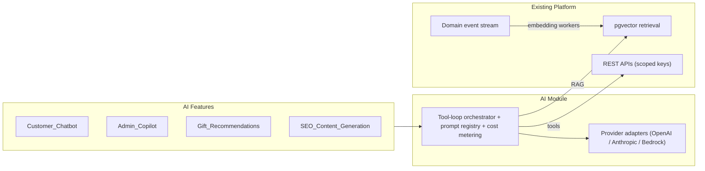

# 27. AI Integration · 28. Plugin Architecture · 29. Scalability Plan · 30. Phasing · 32. Risks · 33. Best Practices

## 27. AI integration strategy

**Principle: AI is a client of the platform, not a tenant inside it.** Every envisioned AI feature (chatbot, gift recommendations, admin copilot, analytics copilot, SEO generation, AI search, workflow automation) reduces to the same shape: *an orchestrator with an LLM, a set of tools, and some retrieval — where the tools are Grifto's existing APIs and the retrieval is Grifto's existing data*. The architecture therefore needs exactly three AI-specific pieces, all already provisioned:

1. **The AI module** (`modules/ai`) — a facade owning provider adapters (OpenAI/Anthropic/Bedrock behind one interface), prompt/version management, cost metering, and the tool-execution loop. Providers are adapters for the same reason payment gateways are.
2. **Retrieval substrate** — `pgvector` tables (`ai_memories`, embeddings on products/CMS/FAQ content, file 08) populated by a worker that subscribes to existing domain events (`product.updated` → re-embed). No separate vector DB until scale demands it; hybrid FTS+vector search composes inside the existing `SearchService` interface (file 11).
3. **Scoped principals** — AI agents authenticate as service principals with **permission-scoped API keys** (file 05). The admin copilot gets `customers.read, analytics.read` and can *propose* actions requiring `payouts.approve` for one-click human confirmation — never execute them. Authorization for AI is the same RBAC vocabulary as for humans; nothing new to audit, and every AI action lands in the same audit log.

Why this works without rewrites: the three hard prerequisites for AI features — clean machine-callable APIs, a complete event stream, and granular permissions — are load-bearing parts of the MVP architecture already. Feature notes: recommendations start as batch jobs writing to a `recommendations` cache table (no live inference in the guest path); SEO generation writes **drafts** into the existing CMS draft/publish flow (human publishes); the analytics copilot runs read-only SQL through a locked-down replica role with row/table allowlists.

## 28. Plugin architecture

Phase 3 territory, but designed now because it constrains earlier choices. Two tiers, adopted in order of increasing trust:

**Tier 1 — Integration plugins (Shopify-app model, external execution):** a plugin is an external service granted OAuth-scoped API access + webhook subscriptions + defined **extension points**. This is the safe default: plugin code never runs in Grifto's process.

- Already-built substrate: scoped keys (file 05), domain events (file 02) — exposing them as signed outbound webhooks is a thin delivery service over the existing EventBridge stream.
- Extension points to open progressively: **theme sections** (a plugin registers remote section schemas; rendering via server-fetched HTML embeds or sandboxed iframes — schema validation unchanged), **admin surfaces** (embedded iframes with signed session tokens, Shopify-style), **workflow hooks** (subscribe to `withdrawal.requested` etc. and call back decision APIs).

**Tier 2 — In-process extensions (only if marketplace economics ever demand it):** sandboxed WASM/isolates with capability-based access. Explicitly out of scope through Phase 3; noted so nobody half-builds it casually — in-process third-party code is a security program, not a feature.

The **theme marketplace** needs no plugin runtime at all: themes are data (the export bundle format, file 07). Validation against the registry + media scanning makes third-party themes tractable much earlier than third-party code.

## 29. Scalability plan

Scaling is staged by **trigger, not by calendar**. Each stage names its signal and its pre-provisioned seam:

| Stage | Trigger | Action | Seam already in place |
|---|---|---|---|
| 1. Vertical + horizontal basics | CPU/latency alarms | More/bigger Fargate tasks; RDS instance class bump | Stateless services, ALB, auto-scaling policies |
| 2. Read offload | DB read CPU > 60% sustained | Read replica; reporting/analytics queries pinned to it | Read-only client path in Drizzle setup |
| 3. Search extraction | File 11 triggers | OpenSearch adapter behind `SearchService` | Interface + event-driven indexer |
| 4. Analytics extraction | `analytics_events` queries degrade OLTP | Stream events to S3/ClickHouse; PG keeps hot window | Events already flow through outbox; partitioned tables detach cleanly |
| 5. Worker specialization | Queue contention between job classes | Split worker service per queue family (media vs money vs notifications) | Queues are already separate; it's an ECS service definition change |
| 6. Module → service extraction | A module needs independent scaling/deploy cadence or team ownership (likely first: Notifications or Media; likely last: Wallet) | Move table family + expose interface over HTTP + re-point event subscriptions to SQS | Module boundaries, outbox events, prefix-grouped tables (files 02/08) |
| 7. Multi-region / multi-tenant | White-label SaaS contracts | `tenant_id` + RLS (new tables carry it from Phase 2), CloudFront multi-origin, regional cells | Terraform modules parameterized by region |

The plan's honesty check: nothing before stage 6 requires an architectural decision — only money and Terraform variables. That is the return on the modular-monolith discipline.

## 30. MVP vs Phase 2 vs Phase 3

| | **MVP (0–6 mo)** | **Phase 2 (6–18 mo)** | **Phase 3 (18 mo+)** |
|---|---|---|---|
| Product | Storefront, auth, wishlists (manual/URL/catalog), guest journey (contribute/reserve/send-later + address approval), ledger wallet, withdrawals with admin approval, notifications (in-app/email), admin dashboard, theme editor v1, CMS, media | Flutter apps (iOS/Android) + FCM, guest accounts, chat (couple↔guest), OpenSearch, first AI features (recommendations, chatbot, SEO drafts), A/B testing, scheduled publish, partial withdrawals, UPI payouts | Vendor + partner portals, public API program, plugin tier 1 + app review, theme marketplace, multi-language/multi-currency, multi-tenant white-label, event platform expansion, registry expansion beyond weddings |
| Architecture | Modular monolith, outbox/events, PG FTS, DB feature flags | Read replica, worker split, analytics offload begins, SSE/WebSocket channel, pgvector live | GraphQL layer (if triggered), first module extractions, RLS multi-tenancy, regional cells |
| Team | 2–4 engineers | 5–9 (+first mobile hire) | Squads per domain |

Built-in-MVP-but-dark (cheap now, expensive later): Dart SDK generation, platform visibility flags in theme documents, locale dimension on CMS entries, sessions/device model with FCM token slot, `tenant_id`-ready conventions, reserved AI/chat schemas.

## 32. Risks and mitigations

| # | Risk | Likelihood / Impact | Mitigation |
|---|---|---|---|
| 1 | **Theme editor scope explosion** — the single biggest schedule risk | High / High | v1/v2 cut is contractual (file 07); document format final from day one so scope cuts never force migrations; ship storefront on hardcoded pages first (sequencing, file 01) |
| 2 | **Money bugs** (double-credit, double-payout, drift) | Medium / Critical | Ledger invariants + idempotency + state machines (file 09); nightly reconciliation with sev-1 on drift; money-path test suite is a release gate |
| 3 | **Gateway dependency** (single, product-owner-owned) | Medium / High | Port/adapter isolation; reconciliation poller covers webhook outages; contractual SLA + sandbox environment required from the gateway |
| 4 | **URL scraper fragility & abuse** (retailer markup changes, SSRF) | High / Medium | Scraping is best-effort with manual-edit fallback (already the PDF's spec); SSRF controls (file 11); per-domain parsers only for top retailers |
| 5 | **Regulatory drift** (payment aggregation, wallet rules in India, DPDP) | Medium / High | Fees-at-withdrawal model keeps Grifto out of stored-value-instrument territory at MVP; legal review before Phase 2 wallet features (UPI payouts, partial withdrawals); DPDP posture from day one (file 11) |
| 6 | **Traffic spikes** (viral wishlist, wedding-season bursts) | Medium / Medium | ISR + CloudFront absorb anonymous reads; auto-scaling on RPS/queue depth; load test the guest journey quarterly |
| 7 | **Small team vs broad surface** | High / Medium | One language, one repo, managed services, generated SDKs — every choice minimizes distinct skills; phasing defers mobile until the API is stable |
| 8 | **Key-person/vendor lock-in** | Low / Medium | Terraform + containers keep AWS portable-enough; OpenAPI keeps clients decoupled; docs (this set) are part of the codebase |

## 33. Best practices (operating rules distilled)

**Architecture:** module boundaries are CI-enforced, not aspirational · every external dependency behind a port/adapter · domain events via outbox only — no dual writes · state machines for anything with a lifecycle · additive API versioning.

**Money:** append-only ledger, balances derived · idempotency keys on every money-moving call · webhooks are the commit signal · reconcile nightly, alert on any drift · snapshot the config (fees) every decision was made under.

**Data:** money in integer minor units · validate JSONB at the boundary · partition unbounded tables from day one · no speculative indexes; `pg_stat_statements` monthly · soft-delete only where business-meaningful.

**Delivery:** trunk-based, feature-flagged, deploy ≠ release · expand/contract migrations · blue-green with alarm-gated canary · preview environments for visual work · E2E on the two revenue journeys as release gates.

**Security:** least-privilege everywhere (humans, services, AI principals share one permission vocabulary) · encrypt sensitive columns, not just disks · strip EXIF from user media · audit log by event subscription, not per-endpoint boilerplate.

**Team:** shared types over documentation · generated SDKs over hand-written clients · boring managed services over interesting self-hosted ones · write the ADR when deviating from this document set.

*(Final recommendation — deliverable §34 — lives with the executive summary in [01-executive-summary.md](01-executive-summary.md).)*
